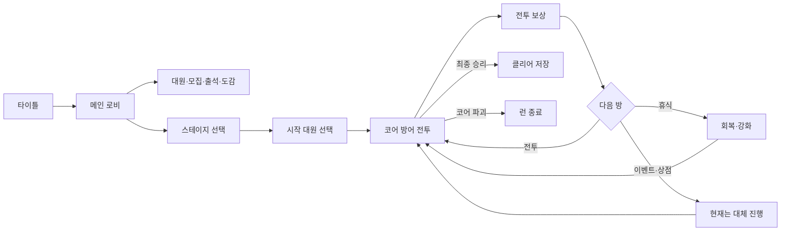

# PS260714 게임 위키

> **문서 기준일:** 2026-08-17  
> 이 문서는 현재 로컬 Unity 프로젝트에서 실제로 플레이 가능한 콘텐츠를 기준으로 작성한 단일 게임 위키다. 코드만 존재하고 플레이 흐름에 연결되지 않은 기능은 별도로 표시한다.

| 기본 정보 | 내용 |
|---|---|
| 프로젝트명 | PS260714 |
| 장르 | 원형 코어 방어 · 자동전투 · 덱 전술 · 로그라이트 |
| 플레이 방식 | 싱글 플레이, 로컬 진행 |
| 엔진 | Unity 6000.3.11f1 |
| 메인 씬 | `ClientScene` 1개 |
| 현재 스테이지 | 테스트 필드, 자유 전투 |
| 지원 언어 | 한국어, 영어 |
| 저장 방식 | 로컬 `PlayerPrefs` JSON |
| 현재 완성 단계 | 핵심 루프를 검증할 수 있는 버티컬 슬라이스 |

## 위키 표기

| 표기 | 의미 |
|---|---|
| **실장** | 현재 게임에서 정상적으로 접근하고 사용할 수 있음 |
| **부분 실장** | 기능은 동작하지만 콘텐츠나 연결 일부가 비어 있음 |
| **미연결** | 관련 코드는 있으나 현재 게임에서 접근할 수 없음 |
| **자리표시자** | 화면 또는 데이터 자리만 존재하고 실제 기능은 없음 |

## 1. 개요

PS260714는 원형 방어선 중앙의 코어를 지키는 전투 게임이다. 대원은 적을 자동으로 공격하고, 플레이어는 대원의 위치를 조정하거나 액티브 기술과 전투 카드를 사용해 전투에 개입한다.

자유 전투에서는 여러 전투를 연속으로 진행한다. 캐릭터 체력과 코어 보호막은 다음 전투로 이어지고, 전투 승리 후 카드 획득 또는 보호막 회복을 선택한다. 전투 사이에는 이벤트, 휴식, 상점 방이 배치된다.

메인 로비에서는 대원 관리, 모집, 출석, 도감과 설정을 이용할 수 있다. 현재 주요 콘텐츠는 전투와 카드 시스템에 집중되어 있으며, 이벤트·상점·전투 아이템과 영구 성장 경제는 제작 중이다.

### 핵심 특징

- 원형 전장에서 진행되는 코어 방어 전투
- 대원의 자동 공격과 플레이어의 위치·기술 조작 결합
- 손패, 버림, 소멸, 재섞기를 사용하는 카드 덱
- 5~8회의 전투로 구성되는 자유 전투 런
- 캐릭터 9명과 역할별 공격·패시브·액티브 능력
- 적 8종과 난이도에 따른 순차 해금
- 모집, 출석, 로스터와 로컬 저장
- 한국어·영어 로컬라이제이션

## 2. 게임 진행

### 기본 진행 순서

1. 타이틀에서 메인 로비로 이동한다.
2. 스테이지 선택에서 테스트 필드 또는 자유 전투를 선택한다.
3. 현재 보유한 대원 중 무작위로 제시된 3명에서 1명을 선택한다.
4. 선택한 대원과 카드 덱으로 코어 방어 전투를 진행한다.
5. 승리 후 카드 획득 또는 코어 보호막 회복을 선택한다.
6. 다음 전투나 비전투 방으로 이동한다.
7. 마지막 전투를 이기면 클리어가 기록되고, 코어가 파괴되면 런이 종료된다.

### 주요 용어

| 용어 | 설명 |
|---|---|
| 대원 | 플레이어가 보유·모집하고 전투에 배치하는 캐릭터 |
| 런 | 던전 입장부터 클리어 또는 패배까지 이어지는 한 번의 진행 |
| 코어 보호막 | 적의 공격을 받아내는 전투 목표물의 체력 |
| 에너지 | 캐릭터 액티브와 전투 카드가 함께 사용하는 자원 |
| 버림 | 다시 섞어 뽑을 수 있는 사용 카드 더미 |
| 소멸 | 현재 전투에서 다시 사용할 수 없는 카드 더미 |
| 난이도 스케일 | 0~100 사이의 전투 진행 강도 |

## 3. 화면과 메뉴

모든 화면은 `ClientScene` 안에 있으며 페이지 활성 상태를 전환하는 방식으로 이동한다.

| 화면 | 상태 | 기능 |
|---|---|---|
| 타이틀 | 실장 | 메인 진입, 공지, 설정 |
| 메인 로비 | 실장 | 대표 대원과 주요 메뉴, 출석 알림 |
| 스테이지 선택 | 실장 | 스테이지 선택, 클리어 표시 |
| 로스터 | 실장 | 보유 대원 조회, 검색, 필터, 정렬, 대표 지정 |
| 모집 | 실장 | 1회·10회 모집, 결과 공개 |
| 거점 | 부분 실장 | 캐릭터·적·카드 도감 진입, 시설 기능은 없음 |
| 캐릭터 도감 | 실장 | 전체 캐릭터 정의와 능력 정보 |
| 적 도감 | 실장 | 전체 적 정의와 능력 정보 |
| 전투 카드 도감 | 실장 | 카드 비용, 대상, 효과 정보 |
| 메인 상점 | 자리표시자 | 상품과 구매 기능 없음 |
| 창고 | 자리표시자 | 분류 UI와 빈 상태 중심 |
| 설정 | 실장 | 언어, 글꼴, 화면, 오디오, 이전 화면 복귀 |
| 던전 | 부분 실장 | 준비, 전투, 보상, 휴식, 이벤트·상점 대체 진행 |

## 4. 스테이지

### 4.1 테스트 필드

테스트 필드는 전투 조작과 카드 사용을 안내하는 1회성 튜토리얼 스테이지다.

| 항목 | 값 |
|---|---:|
| 던전 ID | `test_field` |
| 전투 수 | 1 |
| 시작 대원 | 보유 대원 3명 중 1명 선택 |
| 코어 최대 보호막 | 100 |
| 덱 구성 | 카드 카탈로그의 각 카드 2장 |
| 기본 패 | 5장 |
| 자동 패 교체 | 10초 |
| 멀리건 대기 | 3초 |
| 전투 제한 시간 | 45초 |
| 완료 후 이동 | 스테이지 선택 |

#### 튜토리얼 단계

1. 시작 대원 선택
2. 전장과 코어 소개
3. 적 생성 대기열 안내
4. 캐릭터 조작 안내
5. 카드와 전투 조작 안내
6. 타이머 안내 후 전투 시작

전투에는 적 12명이 등장한다. 3×3 기준 9명은 시작과 함께 배치되고 나머지 3명은 1초 간격으로 생성된다.

> **현재 사양:** 에셋에는 과거의 시작 소모품 필드가 남아 있지만 카드 모드에서는 시작 아이템 선택을 건너뛰므로 실제 화면에는 나타나지 않는다.

### 4.2 자유 전투

자유 전투는 여러 전투와 비전투 방을 연속으로 진행하는 메인 로그라이트 모드다.

| 항목 | 값 |
|---|---:|
| 던전 ID | `free_battle` |
| 전투 수 | 무작위 5~8 |
| 방 패턴 | 전투 사이 이벤트 → 휴식 → 상점 반복 |
| 시작 대원 | 보유 대원 3명 중 1명 선택 |
| 초기 런 재화 | 100 |
| 코어 최대 보호막 | 1,000 |
| 덱 구성 | 카드 카탈로그의 각 카드 1장 |
| 기본 패 | 5장 |
| 자동 패 교체 | 15초 |
| 멀리건 대기 | 3초 |
| 에너지 회복 | 10초마다 1 |
| 보호막 회복 보상 | +20 |

5전 런의 방 순서는 다음과 같다.

`전투 → 이벤트 → 전투 → 휴식 → 전투 → 상점 → 전투 → 이벤트 → 전투`

전투에서 승리하면 현재 난이도 스케일을 10으로 나눈 정수만큼 런에 참가한 캐릭터의 체력이 감소한다. 캐릭터 체력과 코어 보호막은 다음 전투로 이어진다.

### 4.3 난이도 생성

- 첫 전투의 난이도 스케일은 0, 마지막 전투는 100이다.
- 중간 전투는 선형 진행도에 최대 ±8의 변동을 더하되 이전 전투보다 높도록 보정한다.
- 난이도 0~29는 크기 3, 30~64는 4, 65~89는 5, 90~100은 6을 사용한다.
- 초기 적 수는 크기의 제곱과 16→28 선형 증가값 중 큰 값이다.
- 적 체력 배율은 진행에 따라 최대 3배까지 증가한다.
- 적 체력 편차는 2에서 3까지 증가한다.
- 기본 제한 시간은 180초다.
- 적 생성 간격은 후반에 최소 2.5초까지 감소한다.
- 현재 난이도에서 해금된 적만 후보가 되며 위협도를 반영해 구성한다.

현재 고정 전투 `BattleSO`는 없으며 테스트 필드와 자유 전투 모두 런타임 생성 전투를 사용한다.

## 5. 전투 시스템

### 5.1 전장과 승패

- 전장은 반지름 약 2.27의 원형 방어 구역이다.
- 적은 방어 구역 바깥에서 생성되어 코어 방향으로 접근한다.
- 적이 방어선에 도달하면 자신의 주기마다 코어를 공격한다.
- 모든 예정 적과 생존 적이 사라지면 승리한다.
- 코어 보호막이 0이 되면 패배한다.
- 제한 시간이 끝나면 타임아웃으로 처리한다.
- 일시정지와 1×, 2×, 3× 배속을 지원한다.

### 5.2 대원 조작

- 대원은 사거리와 공격 주기에 따라 적을 자동으로 선택해 공격한다.
- 대원을 선택한 뒤 원형 방어 구역 안의 위치로 이동할 수 있다.
- 수동 대상 기술은 전투를 멈추고 적 또는 아군을 선택한다.
- 범위 기술은 시전자 중심 또는 플레이어가 지정한 월드 지점을 기준으로 사용할 수 있다.
- 상태 효과, 적 쿨다운 능력, 캐릭터 패시브·기본 공격과 적 생성 대기열이 같은 전투 시간축에서 갱신된다.

파티 시스템은 최대 4명을 지원한다. 그러나 현재 시작 시 대원 1명만 선택하고 신규 대원 보상이 연결되어 있지 않아 실제 런은 대원 1명으로 진행된다.

### 5.3 에너지

| 항목 | 값 |
|---|---:|
| 기본 최대 에너지 | 3 |
| 전투 시작 에너지 | 최대치 |
| 자유 전투 회복 시간 | 10초마다 1 |
| 사용처 | 대원 액티브, 전투 카드 |
| 최소 회복 시간 지원값 | 0.5초 |

최대 에너지 +1과 회복 시간 -0.5초 강화 코드는 존재하지만 현재 전투 보상 후보에는 연결되지 않는다.

## 6. 카드 시스템

### 6.1 덱 규칙

- 덱은 전체 카드, 뽑기, 손, 버림, 소멸 더미로 나뉜다.
- 전투 시작 시 덱을 섞고 기본 패만큼 뽑는다.
- 자동 패 교체 시간이 되면 현재 손을 버리고 새 패를 뽑는다.
- 뽑기 더미가 부족하면 버림 더미를 다시 섞는다.
- 멀리건은 현재 손을 버리고 3초 뒤 새 패를 뽑는다.
- 카드 드로우 효과는 기존 손에 즉시 카드를 추가한다.
- 사용에 성공한 카드만 에너지를 소비하고 버림 또는 소멸 더미로 이동한다.
- 런에서 획득한 카드는 다음 전투부터 덱에 포함된다.

### 6.2 카드 목록

현재 카드 10장은 모두 공용·일반 등급이며 시작 덱과 던전 보상에 포함될 수 있다.

| 카드 | 비용 | 처리 | 대상과 효과 | 현재 사용 가능성 |
|---|---:|---|---|---|
| 공격 0 | 1 | 소멸 | 적 1명에게 피해 15 | 가능 |
| 공격 1 | 2 | 소멸 | 지정 지점 반지름 2에 피해 10 | 가능 |
| 공격 2 | 2 | 소멸 | 무작위 적 3명에게 각각 피해 10 | 가능 |
| 공격 3 | 4 | 버림 | 적 2명에게 각각 피해 10 | **기본 최대 에너지 초과** |
| 공격 4 | 5 | 버림 | 지정 지점 반지름 8에 피해 20 | **기본 최대 에너지 초과** |
| 수리 | 5 | 버림 | 코어 보호막 100 회복 | **기본 최대 에너지 초과** |
| 뽑기 | 2 | 소멸 | 카드 2장 즉시 드로우 | 가능 |
| 버프 0 | 3 | 소멸 | 선택 아군에게 Power 1스택, 10초 | 가능 |
| 버프 1 | 3 | 소멸 | 선택 아군에게 Speed 1스택, 10초 | 가능 |
| 버프 2 | 5 | 소멸 | 모든 아군에게 Power 2스택, 5초 | **기본 최대 에너지 초과** |

> **밸런스 주의:** 현재 기본 최대 에너지는 3이고 최대치 상승 보상이 연결되어 있지 않다. 따라서 비용 4~5인 카드 4장은 실제 런에서 사용할 수 없다.

### 6.3 전투 보상

전투 승리 후 먼저 보상 카테고리를 선택한다.

| 보상 | 상태 | 동작 |
|---|---|---|
| 카드 | 실장 | 무작위 카드 최대 3장 중 1장 획득 |
| 코어 보호막 | 실장 | 현재 보호막 +20 |
| 전투 아이템 | 미연결 | 아이템 에셋이 없어 후보에 나타나지 않음 |
| 신규 대원 | 미연결 | 적용 코드가 있으나 후보 생성에서 제외됨 |
| 대원 강화 | 미연결 | 적용 코드가 있으나 후보 생성에서 제외됨 |
| 에너지 강화 | 미연결 | 적용 코드가 있으나 후보 생성에서 제외됨 |

현재 첫 보상 화면에는 카드와 보호막의 2개 선택지가 나타난다.

## 7. 캐릭터

현재 캐릭터는 9명이며 모두 `Grade2`, 기본 최대 체력 100이다. 최초 보유 캐릭터는 아이슬린, 새나, 스이렌이다.

| 캐릭터 | 직군 | 최초 보유 | 공격력 | 공격 쿨다운 | 패시브 | 공격 정의 | 액티브/비용 |
|---|---|---:|---:|---:|---:|---:|---|
| 아이슬린 (Aisling) | 사수 | O | 7 | 4초 | 1 | 1 | 1개 / 2 |
| 별하 (Byeolha) | 전위 | X | 2 | 1.5초 | 2 | 1 | 1개 / 1 |
| 칼리스타 (Calista) | 전위 | X | 3 | 2.5초 | 2 | 1 | 1개 / 1 |
| 이사나 (Isana) | 전위 | X | 3 | 2초 | 2 | 2 | 1개 / 3 |
| 이졸데 (Isolde) | 술사 | X | 1 | 1.5초 | 2 | 2 | 1개 / 5 |
| 릴리아스 (Lilias) | 지원 | X | 3 | 6초 | 1 | 1 | 1개 / 2 |
| 미리내 (Mirinae) | 술사 | X | 3 | 3초 | 1 | 1 | 2개 / 3, 1 |
| 새나 (Saena) | 척후 | O | 5 | 2초 | 1 | 1 | 1개 / 2 |
| 스이렌 (Suiren) | 지원 | O | 1 | 3초 | 3 | 2 | 1개 / 1 |

캐릭터 능력은 피해, 상태 부여·제거, 자원 증감, 회복, 체력 소모, 보호막, 카드 드로우 효과를 조합한다. Combo, Ready, StarPowder, EmergencyKit 같은 캐릭터별 자원을 패시브와 공격이 공유한다.

모든 캐릭터의 휴식 전용 기술은 현재 비활성 또는 비어 있다. 이졸데의 액티브는 비용 5이므로 현재 최대 에너지 3으로는 사용할 수 없다.

### 배경 설정 현황

캐릭터 설명에는 학원 학생, 천문학부와 학부장, 기사단 계열 교환학생 등의 소속이 등장한다. 현재 이를 연결하는 스토리 스테이지, 퀘스트 또는 대화 콘텐츠는 없다.

## 8. 적

현재 적은 8종이다. 모든 적은 기본 체력 20, 코어 공격력 5, 코어 공격 주기 2초, 접근 속도 0.08, 크기 1×1로 작성되어 있다.

| 적 | 등급 | 해금 난이도 | 실제 에셋 능력 |
|---|---|---:|---|
| Basic | 일반 | 0 | 없음 |
| Assault | 일반 | 10 | 없음 |
| Heavy | 일반 | 20 | 없음 |
| Medic | 일반 | 30 | 4초마다 상하좌우 인접 아군 체력 1 회복 |
| Infiltrator | 특수 | 40 | 없음 |
| Mechanic | 일반 | 45 | 10초마다 누적 피해가 가장 높은 대원을 5초 기절 |
| Pointman | 특수 | 55 | 없음 |
| Shield Bearer | 특수 | 70 | 없음 |

런타임은 방어 횟수, 추가 생성, 피해 전환, 우선순위 제외 같은 적 행동을 지원한다. 그러나 Heavy, Infiltrator, Pointman, Shield Bearer 에셋에는 현재 능력이 작성되어 있지 않다. 실제 고유 능력을 가진 적은 Medic과 Mechanic 2종이다.

## 9. 상태 효과

상태 효과는 총 15종이다.

| 분류 | 상태 | 역할 |
|---|---|---|
| 지속 피해 | Fire, Blood, Poison | 일정 주기의 피해와 스택 처리 |
| 공격 보조 | Opening | 받는 피해 증가 |
| 능력치 강화 | Power, Speed | 공격력·공격 속도 변경 |
| 제어·타겟 | Stun, Focus | 행동 정지, 공격 우선 대상 지정 |
| 조건 버프 | DualSide | 캐릭터 공격 분기 조건 |
| 전용 자원 | Combo, Ready, Ready_0, Ready_4, StarPowder, EmergencyKit | 캐릭터 능력 사이의 스택 상태 공유 |

상태 효과 시스템은 지속시간, 최대 스택, 갱신 방식, 독립 스택, 주기 트리거, 능력치 수정과 행동 제어를 공통 처리한다.

## 10. 비전투 방

### 10.1 이벤트

| 항목 | 상태 |
|---|---|
| 이벤트 에셋 | `event_barricate`, `event_over_supply` 2개 |
| 던전 연결 | 없음 |
| 선택 비용·조건·효과 | 비어 있음 |
| 현재 플레이 | 대체 진행 버튼으로 통과 |

이벤트 시스템 자체는 런 재화, 파티 회복, 최대 에너지, 에너지 회복 속도와 전투 아이템 획득을 지원한다. `event_barricate`의 두 번째 선택 노드는 시작 노드에서 연결되지 않아 현재 구조로는 도달할 수 없다.

### 10.2 휴식

`RestDefault`가 자유 전투의 기본 휴식으로 연결되어 있다. 방마다 1회 행동할 수 있다.

| 선택 | 효과 |
|---|---|
| 회복 | 선택 대원의 최대 체력 30% 회복, 부활 허용 |
| 강화 | 선택 대원의 던전 강화 1회 |
| 아이템 사용 | 보유 전투 아이템 1개 사용 |

전투 아이템 에셋이 없고 캐릭터 휴식 기술도 비활성이라 현재 유효한 선택은 주로 회복과 기본 강화다.

### 10.3 상점

던전 상점은 가격, 단일 구매, 구매 효과를 처리할 수 있지만 실제 `DungeonShopSO` 에셋과 상품이 없다. 자유 전투의 상점 방은 `ROOM DATA NOT CONFIGURED / CONTINUE` 대체 버튼으로 통과한다.

### 10.4 전투 아이템

시작 아이템 선택, 슬롯별 재굴림, 사용 횟수, 소모·무제한 아이템, 전투 보상과 휴식 사용 코드는 구현되어 있다. 실제 `BattleItemSO` 에셋은 0개이므로 현재 게임에서는 사용할 수 없다.

## 11. 모집과 경제

### 11.1 영구 아이템

| 항목 | ID/종류 | 초기 수량 |
|---|---|---:|
| 일반 크레딧 | `currency.soft` | 0 |
| 유료 크레딧 | `currency.premium.paid` | 0 |
| 무료 크레딧 | `currency.premium.free` | 0 |
| 기본 강화 재료 | 성장 재료 | 0 |
| 표준 모집 티켓 | 모집 티켓 | 10 |

인벤토리는 여러 항목의 증감을 검증한 뒤 한 번에 적용한다. 현재 상점과 성장 소비처가 없어 모집과 출석 외의 경제 순환은 완성되지 않았다.

### 11.2 모집

- 상시 표준 배너 1개를 제공한다.
- 1회 모집과 10회 모집을 지원한다.
- 현재 9명의 Grade2 캐릭터만 같은 등급 풀에 포함된다.
- 등급 확률은 Grade2 100%다.
- 표준 모집 티켓을 우선 사용하고 부족하면 무료 크레딧을 사용한다.
- 1회 비용은 티켓 1장 또는 무료 크레딧 500이다.
- 최초 획득 시 캐릭터가 해금되고 결과 화면에 신규 표시가 붙는다.
- 중복 보상, 교환 재화, 천장·스택 규칙은 없다.
- 모집 누적 카운터는 별도 영구 저장되지 않는다.

신규 프로필은 표준 모집 티켓 10장으로 시작하므로 즉시 10회 모집이 가능하다.

### 11.3 출석

기본 출석은 콘텐츠 버전 2, UTC+9 자정 갱신, 28일 반복형이다. 7일 보상 패턴을 4회 반복한다.

| 일차 | 보상 |
|---:|---|
| 1 | 일반 크레딧 1,000 |
| 2 | 기본 강화 재료 5 |
| 3 | 표준 모집 티켓 1 |
| 4 | 일반 크레딧 1,500 |
| 5 | 기본 강화 재료 10 |
| 6 | 무료 크레딧 50 |
| 7 | 표준 모집 티켓 2 |

보상은 출석 순서대로 수동 수령한다. 마지막 확인 시각보다 로컬 시각이 뒤로 간 경우 수령을 차단한다.

## 12. 저장과 설정

### 저장되는 데이터

- 캐릭터 보유, 성장과 대표 대원
- 아이템과 재화 수량
- 출석 진행도와 마지막 확인 시각
- 던전 클리어 진행도
- 언어, 글꼴, 화면과 오디오 설정

저장 데이터는 버전이 포함된 JSON으로 `PlayerPrefs`에 기록된다. 백업 복원, 손상 감지, 지원하지 않는 버전 차단과 로컬 초기화 경로를 제공한다.

### 저장되지 않는 데이터

진행 중인 던전 런은 앱 재실행 후 복원되지 않는다.

- 현재 캐릭터 체력
- 코어 보호막
- 런 덱과 손패
- 현재 방 위치
- 런 재화
- 런 중 획득한 카드·강화

출석 시각과 모집·유료 재화 역시 서버 권위가 아닌 로컬 데이터다.

## 13. 로컬라이제이션과 표현

| 항목 | 현재 내용 |
|---|---|
| 문자열 | 376행 |
| 언어 | 한국어 `ko-KR`, 영어 `en-US` |
| 원본 | CSV |
| 런타임 | 에디터에서 생성한 C# 테이블 |
| 마크업 | 이름 기반 변수, 숫자 형식, `[style]`, `[icon]`, `[br]` |
| 글꼴 | 언어·용도별 글꼴과 fallback 지원 |
| 전투 VFX 큐 | 9개 |

현재 카드 이름에는 `공격 0`, `버프 1` 같은 제작용 명칭이 남아 있고 일부 영어 직군·설명에 오탈자가 있다. 데이터가 없는 방과 일부 동적 휴식 문구는 로컬라이제이션 키 대신 한국어·영어 하드코딩 fallback을 사용한다.

## 14. 콘텐츠 현황

`Assets/06_Runtime/Resources`의 실제 에셋 기준 수량이다.

| 콘텐츠 | 수량 | 상태 |
|---|---:|---|
| 캐릭터 | 9 | 실장, 모두 Grade2 |
| 적 | 8 | 부분 실장, 실제 능력 작성 2종 |
| 전투 카드 | 10 | 실장, 비용 정합성 문제 4장 |
| 상태 효과 | 15 | 실장 |
| 전투 VFX 큐 | 9 | 실장 |
| 던전 정의 | 2 | 테스트 필드·자유 전투 |
| 튜토리얼 | 1 | 테스트 필드 연결 |
| 던전 이벤트 | 2 | 미연결, 효과 없음 |
| 휴식 | 1 | 자유 전투 연결 |
| 던전 흐름 정책 | 2 | 고정·교차 흐름 |
| 영구 아이템 | 5 | 재화 3, 재료 1, 티켓 1 |
| 전투 아이템 | 0 | 코드만 존재 |
| 고정 전투 `BattleSO` | 0 | 생성 전투 사용 |
| 던전 상점 | 0 | 코드만 존재 |
| 로컬라이제이션 문자열 | 376 | 한국어·영어 |

## 15. 개발 현황

### 현재 플레이 가능한 범위

- 타이틀에서 메인 로비 진입
- 보유 캐릭터 조회와 대표 캐릭터 지정
- 표준 배너 모집과 캐릭터 해금
- 출석 보상 수령
- 테스트 필드 튜토리얼
- 자유 전투 5~8전
- 대원 자동 공격, 위치 이동, 액티브와 카드 사용
- 카드 또는 보호막 전투 보상
- 휴식의 회복과 강화
- 승패 결과와 던전 클리어 저장

### 알려진 주요 문제

| 우선순위 | 문제 | 게임에 미치는 영향 |
|---|---|---|
| P0 | 최대 에너지 3보다 비용이 높은 카드 4장 | 시작 덱에 들어오지만 사용할 수 없음 |
| P0 | 이졸데 액티브 비용 5 | 캐릭터 핵심 기술 사용 불가 |
| P0 | 이벤트·상점 기본 데이터 미연결 | 자유 전투 방이 오류 대체 화면으로 진행 |
| P0 | 신규 대원·에너지 강화 보상 미연결 | 최대 4인 파티와 런 성장 경로가 나타나지 않음 |
| P0 | 특수 적 4종의 능력 에셋이 비어 있음 | 이름과 실제 전투 차별성이 일치하지 않음 |
| P1 | 전투 아이템 0개 | 시작·보상·휴식의 아이템 기능을 사용하지 못함 |
| P1 | 모집 중복·천장 없음 | 장기 수집 구조가 완성되지 않음 |
| P1 | 재화·재료 소비처 부족 | 메타 경제 순환이 형성되지 않음 |
| P1 | 제작용 명칭과 번역 오탈자 | 플레이어에게 프로토타입 인상을 줌 |
| P2 | 진행 중인 런 저장 없음 | 앱 종료 시 런을 이어 할 수 없음 |
| P2 | PlayMode 통합 테스트 부족 | 전체 플레이 흐름 회귀 위험이 큼 |

### 권장 다음 마일스톤

1. 비용 1~3 카드만으로 덱을 구성하거나 에너지 성장 보상을 보장한다.
2. 효과 있는 이벤트 1개와 상품 있는 상점 1개를 자유 전투에 연결한다.
3. 5전 고정 검증 런에서 전투, 이벤트, 휴식, 상점을 모두 경험하게 한다.
4. Medic 외 특수 적 1종에 실제 고유 능력을 작성한다.
5. 클리어 보상 하나를 영구 성장 또는 모집 경제에 연결한다.
6. 이 전체 경로를 PlayMode 통합 테스트로 고정한다.

## 16. 시스템 부록

### 구조

- 단일 `ClientScene`에서 `IPage` 기반 페이지를 전환한다.
- 정적 콘텐츠는 `Resources`의 ScriptableObject와 카탈로그에서 읽는다.
- 캐릭터·적·카드·아이템 정의와 런타임 상태를 분리한다.
- `GameManager`가 데이터, 오디오, 전투와 전역 이벤트 관리자를 연결한다.
- `BattleManager`가 전투 시간과 상태를 관리한다.
- `DungeonPage`가 런 진행과 전투 서비스를 조립한다.
- `DungeonBoardView`가 전장, 적 생성, 대상, 상태 효과와 월드 입력을 담당한다.
- 런타임, 에디터, EditMode 테스트, PlayMode 테스트가 asmdef로 분리되어 있다.

### 공통 능력

캐릭터 기본 공격·액티브·패시브, 적 능력, 카드, 전투 아이템, 상태 트리거는 다음 공통 효과 규칙과 실행기를 공유한다.

| 효과 | 용도 |
|---|---|
| Damage | 고정·능력치·체력·자원·상태 비례 피해 |
| ApplyStatus / RemoveStatus | 상태 부여와 제거 |
| GainResource / SpendResource | 캐릭터별 자원·스택 증감 |
| Heal / SpendHealth | 체력 회복과 체력 비용 |
| Shield | 코어 또는 대상의 보호막 회복 |
| CardDraw | 현재 손에 카드 추가 |

이벤트와 휴식은 전투 효과 실행기와 분리된 Run 도메인 실행기를 사용한다.

### 검증 상태

- `dotnet build PS260714.slnx`: 성공, 오류 0개.
- 빌드 경고: Unity 패키지·분석기 경고 30개.
- 테스트 코드 표식: EditMode 560개, PlayMode 1개.
- 위 테스트 수는 코드 표식 수이며 Unity Test Runner 전체 통과 수가 아니다.

### 주요 근거 경로

| 영역 | 경로 |
|---|---|
| 메인 씬 | `Assets/04_Scenes/ClientScene.unity` |
| 런타임 콘텐츠 | `Assets/06_Runtime/Resources` |
| 던전 진행 | `Assets/10_Scripts/Run/DungeonPage.cs` |
| 던전 보상 | `Assets/10_Scripts/Run/DungeonEventTab.cs` |
| 비전투 방 | `Assets/10_Scripts/Run/DungeonRoomView.cs` |
| 전투 관리자 | `Assets/10_Scripts/Battle/BattleManager.cs` |
| 공통 효과 | `Assets/10_Scripts/Core/Effects` |
| 캐릭터 | `Assets/10_Scripts/Characters`, `Assets/06_Runtime/Resources/Characters` |
| 적 | `Assets/10_Scripts/Enemies`, `Assets/06_Runtime/Resources/Enemies` |
| 모집·출석 | `Assets/10_Scripts/UI`, `Assets/10_Scripts/Attendance` |
| 로컬라이제이션 | `Assets/10_Scripts/Localization`, `Assets/11_LocalizationSource` |

