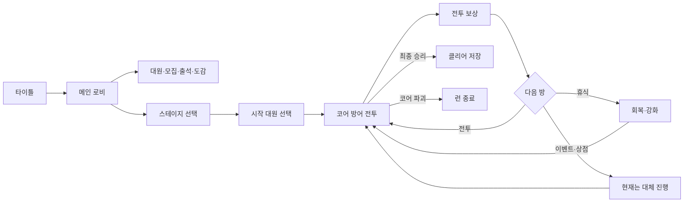

# PS260714 게임 위키

> **문서 기준일:** 2026-08-18
> 이 문서는 현재 로컬 Unity 프로젝트의 실제 플레이 콘텐츠와 제작 중인 카드 카탈로그 교체 상태를 함께 기록한 단일 게임 위키다. 코드·원본 명세·라이브 ScriptableObject 에셋의 상태가 다르면 각각을 분리해 표시한다.

| 기본 정보 | 내용 |
|---|---|
| 프로젝트명 | PS260714 |
| 장르 | 원형 코어 방어 · 자동전투 · 덱 전술 · 로그라이트 |
| 플레이 방식 | 싱글 플레이, 로컬 진행 |
| 엔진 | Unity 6000.3.11f1 |
| 메인 씬 | `ClientScene` 1개 |
| 현재 스테이지 | 튜토리얼 필드, 연습 전투, 자유 전투 |
| 지원 언어 | 한국어, 영어 |
| 저장 방식 | 로컬 `PlayerPrefs` JSON |
| 현재 완성 단계 | 핵심 루프를 검증할 수 있는 버티컬 슬라이스 |

## 위키 표기

| 표기 | 의미 |
|---|---|
| **실장** | 현재 게임에서 정상적으로 접근하고 사용할 수 있음 |
| **부분 실장** | 기능은 동작하지만 콘텐츠나 연결 일부가 비어 있음 |
| **미연결** | 관련 코드는 있으나 현재 게임에서 접근할 수 없음 |
| **자리표시자** | 화면 또는 데이터 자리만 존재하고 실제 기능은 없음 |

> **카드 교체 상태:** `card.catalog.c001`~`c100` 에셋과 메타, 한국어·영어 로컬라이제이션 및 schema v2 실행 코드를 생성했고 레거시 `Attack0`, `NewBattleCard 1`~`9`는 제거했다. DOCX 100행과 에셋의 독립 대조, GUID·참조·분포 검증을 통과했으며 실제 Unity Editor 임포트도 완료했다. 임포트 중 발견된 로컬라이제이션 참조 텍스트 충돌과 동적 폰트 검증 오탐은 수정했지만 PlayMode 확인은 아직 실행하지 않았다.

## 1. 개요

PS260714는 원형 방어선 중앙의 코어를 지키는 전투 게임이다. 대원은 적을 자동으로 공격하고, 플레이어는 대원의 위치를 조정하거나 액티브 기술과 전투 카드를 사용해 전투에 개입한다.

자유 전투에서는 여러 전투를 연속으로 진행한다. 캐릭터 체력과 코어 보호막은 다음 전투로 이어지고, 전투 승리 후 카드 획득 또는 보호막 회복을 선택한다. 전투 사이에는 이벤트, 휴식, 상점 방이 배치된다.

메인 로비에서는 대원 관리, 모집, 출석, 도감과 설정을 이용할 수 있다. 현재 주요 콘텐츠는 전투와 카드 시스템에 집중되어 있으며, 이벤트·상점·전투 아이템과 영구 성장 경제는 제작 중이다.

### 핵심 특징

- 원형 전장에서 진행되는 코어 방어 전투
- 대원의 자동 공격과 플레이어의 위치·기술 조작 결합
- 손패, 버림, 소멸, 재섞기를 사용하는 카드 덱
- 5~8회의 전투로 구성되는 자유 전투 런
- 캐릭터 9명과 역할별 공격·패시브·액티브 능력
- 적 8종과 난이도에 따른 순차 해금
- 모집, 출석, 로스터와 로컬 저장
- 한국어·영어 로컬라이제이션

## 2. 게임 진행

### 기본 진행 순서

1. 타이틀에서 메인 로비로 이동한다.
2. 스테이지 선택에서 튜토리얼 필드, 연습 전투 또는 자유 전투를 선택한다.
3. 현재 보유한 대원 중 무작위로 제시된 3명에서 1명을 선택한다.
4. 선택한 대원과 카드 덱으로 코어 방어 전투를 진행한다.
5. 승리 후 카드 획득 또는 코어 보호막 회복을 선택한다.
6. 다음 전투나 비전투 방으로 이동한다.
7. 마지막 전투를 이기면 클리어가 기록되고, 코어가 파괴되면 런이 종료된다.

### 주요 용어

| 용어 | 설명 |
|---|---|
| 대원 | 플레이어가 보유·모집하고 전투에 배치하는 캐릭터 |
| 런 | 던전 입장부터 클리어 또는 패배까지 이어지는 한 번의 진행 |
| 코어 보호막 | 적의 공격을 받아내는 전투 목표물의 체력 |
| 에너지 | 캐릭터 액티브와 전투 카드가 함께 사용하는 자원 |
| 버림 | 다시 섞어 뽑을 수 있는 사용 카드 더미 |
| 소멸 | 현재 전투에서 다시 사용할 수 없는 카드 더미 |
| 난이도 스케일 | 0~100 사이의 전투 진행 강도 |

## 3. 화면과 메뉴

모든 화면은 `ClientScene` 안에 있으며 페이지 활성 상태를 전환하는 방식으로 이동한다.

| 화면 | 상태 | 기능 |
|---|---|---|
| 타이틀 | 실장 | 메인 진입, 공지, 설정 |
| 메인 로비 | 실장 | 대표 대원과 주요 메뉴, 출석 알림 |
| 스테이지 선택 | 실장 | 스테이지 선택, 클리어 표시 |
| 로스터 | 실장 | 보유 대원 조회, 검색, 필터, 정렬, 대표 지정 |
| 모집 | 실장 | 1회·10회 모집, 결과 공개 |
| 거점 | 부분 실장 | 캐릭터·적·카드 도감 진입, 시설 기능은 없음 |
| 캐릭터 도감 | 실장 | 전체 캐릭터 정의와 능력 정보 |
| 적 도감 | 실장 | 전체 적 정의와 능력 정보 |
| 전투 카드 도감 | 부분 실장 | 카드 비용, 대상, 효과 정보. 새 100장 카탈로그의 화면 표시 확인 필요 |
| 메인 상점 | 자리표시자 | 상품과 구매 기능 없음 |
| 창고 | 자리표시자 | 분류 UI와 빈 상태 중심 |
| 설정 | 실장 | 언어, 글꼴, 화면, 오디오, 이전 화면 복귀 |
| 던전 | 부분 실장 | 준비, 전투, 보상, 휴식, 이벤트·상점 대체 진행 |

## 4. 스테이지

### 4.1 튜토리얼 필드

튜토리얼 필드는 전투 조작과 카드 사용을 안내하는 1회성 튜토리얼 스테이지다. 기존 `test_field` ID는 `tutorial_field`로 변경했으며, 과거 저장과 호출은 카탈로그 마이그레이션을 통해 같은 스테이지로 읽는다.

| 항목 | 값 |
|---|---:|
| 던전 ID | `tutorial_field` (`test_field` 레거시 호환) |
| 전투 수 | 1 |
| 시작 대원 | 보유 대원 3명 중 1명 선택 |
| 코어 최대 보호막 | 100 |
| 덱 구성 | 시작 카드 10종을 각 2장씩 구성, 총 20장 |
| 기본 패 | 5장 |
| 자동 패 교체 | 10초 |
| 멀리건 대기 | 3초 |
| 전투 제한 시간 | 45초 |
| 완료 후 이동 | 스테이지 선택 |

#### 튜토리얼 단계

1. 시작 대원 선택
2. 전장과 코어 소개
3. 적 생성 대기열 안내
4. 캐릭터 조작 안내
5. 카드와 전투 조작 안내
6. 타이머 안내 후 전투 시작

전투에는 적 12명이 등장한다. 3×3 기준 9명은 시작과 함께 배치되고 나머지 3명은 1초 간격으로 생성된다.

> **현재 사양:** 에셋에는 과거의 시작 소모품 필드가 남아 있지만 카드 모드에서는 시작 아이템 선택을 건너뛰므로 실제 화면에는 나타나지 않는다.

### 4.2 연습 전투

연습 전투는 시간 제한, 자동 승패, 보상과 클리어 저장 없이 전투 요소를 시험하는 전용 던전 모드다. 시작 대원과 기본 손패를 강제하지 않으며 전투 중 컨트롤 패널에서 캐릭터·적·카드를 직접 추가한다.

| 항목 | 값 |
|---|---:|
| 던전 ID | `practice_battle` |
| 런 모드 | `Practice` |
| 전투 수 | 1개 연습 세션 |
| 시작 대원·아이템 선택 | 없음 |
| 제한 시간 | 무제한 |
| 자동 승리·패배 | 없음 |
| 전투 보상·클리어 저장 | 없음 |
| 완료 후 이동 | 스테이지 선택 |

컨트롤 패널은 전체 캐릭터·적·카드 카탈로그 검색, 캐릭터 배치와 제거, 적 즉시·대기열 생성, 카드 손패 추가, 적 제거, 파티·방어선·에너지 복구와 전체 초기화를 제공한다. 연습 중 생성된 캐릭터 상태와 던전 결과는 로컬 진행 데이터에 기록하지 않는다.

디버그 표시는 기본적으로 꺼져 있다. 켜면 실제 입력 판정과 동일한 모든 생존 유닛의 클릭 원, 캐릭터·적의 공간 점유 반경, 마지막으로 클릭한 캐릭터의 유한 능력 범위, 마지막으로 클릭한 적의 Target·Operation·Telegraph·Area 범위, 적에서 방어선 방향으로 계산되는 코어 공격 도달 선분을 전장 위에 표시한다. 일반 공격 범위를 임의의 원으로 단순화하거나 축·텍스트를 덧그리지 않으며, 기능을 끄거나 보드를 비활성화·초기화하고 대상이 제거되면 남은 표식을 즉시 비운다.

### 4.3 자유 전투

자유 전투는 여러 전투와 비전투 방을 연속으로 진행하는 메인 로그라이트 모드다.

| 항목 | 값 |
|---|---:|
| 던전 ID | `free_battle` |
| 전투 수 | 무작위 5~8 |
| 방 패턴 | 전투 사이 이벤트 → 휴식 → 상점 반복 |
| 시작 대원 | 보유 대원 3명 중 1명 선택 |
| 초기 런 재화 | 100 |
| 코어 최대 보호막 | 1,000 |
| 덱 구성 | 시작 카드 10종을 각 1장씩 구성, 총 10장 |
| 기본 패 | 5장 |
| 자동 패 교체 | 15초 |
| 멀리건 대기 | 3초 |
| 에너지 회복 | 10초마다 1 |
| 보호막 회복 보상 | +20 |

5전 런의 방 순서는 다음과 같다.

`전투 → 이벤트 → 전투 → 휴식 → 전투 → 상점 → 전투 → 이벤트 → 전투`

전투에서 승리하면 현재 난이도 스케일을 10으로 나눈 정수만큼 런에 참가한 캐릭터의 체력이 감소한다. 캐릭터 체력과 코어 보호막은 다음 전투로 이어진다.

> **카탈로그 전환:** 위 덱 구성은 새 카탈로그의 `AvailableAsStartingCard` 플래그를 사용한다. 시작 카드 10종은 업로드 DOCX에 별도 지정된 값이 아니라 현재 버티컬 슬라이스용 프로젝트 설정이다.

### 4.4 난이도 생성

- 첫 전투의 난이도 스케일은 0, 마지막 전투는 100이다.
- 중간 전투는 선형 진행도에 최대 ±8의 변동을 더하되 이전 전투보다 높도록 보정한다.
- 난이도 0~29는 크기 3, 30~64는 4, 65~89는 5, 90~100은 6을 사용한다.
- 초기 적 수는 크기의 제곱과 16→28 선형 증가값 중 큰 값이다.
- 적 체력 배율은 진행에 따라 최대 3배까지 증가한다.
- 적 체력 편차는 2에서 3까지 증가한다.
- 기본 제한 시간은 180초다.
- 적 생성 간격은 후반에 최소 2.5초까지 감소한다.
- 현재 난이도에서 해금된 적만 후보가 되며 위협도를 반영해 구성한다.

현재 고정 전투 `BattleSO`는 없으며 테스트 필드와 자유 전투 모두 런타임 생성 전투를 사용한다.

## 5. 전투 시스템

### 5.1 전장과 승패

- 전장은 반지름 약 2.27의 원형 방어 구역이다.
- 적은 방어 구역 바깥에서 생성되어 코어 방향으로 접근한다.
- 원형 전장은 기본 12개 섹터와 섹터당 최대 3개 방사형 층을 사용한다. 첫 배치 한도는 12명, 전장 전체 동시 수용 한도는 36명이며, 한도가 차면 남은 적은 빈 진형 칸이 생길 때까지 생성 대기열에 머문다.
- 같은 섹터의 적은 앞에서 뒤로 층을 쌓고, 서로 다른 섹터의 적도 각 적의 점유 반경과 전장 분리 비율을 기준으로 중심 간 최소 거리를 유지한다. 기본 분리 비율 0.75는 시각적으로 약 25%까지 겹침을 허용하지만 중심이 완전히 포개지는 것은 막는다.
- 전열 적이 쓰러지면 같은 섹터의 후열이 빈 층을 채우며 방어선 방향으로 전진한다.
- 적은 방어선과의 거리가 자신의 `Core Attack Range` 이내일 때 코어 공격 타이머를 진행한다. 사거리 0은 전열에 도달해야 공격하는 근접 적이고, 충분한 사거리를 가진 적은 후열에서도 코어를 공격할 수 있다.
- 모든 예정 적과 생존 적이 사라지면 승리한다.
- 코어 보호막이 0이 되면 패배한다.
- 제한 시간이 끝나면 타임아웃으로 처리한다.
- 일시정지와 1×, 2×, 3× 배속을 지원한다.

코어는 공통 전투 목표물 `IBattleObjective`로 노출된다. 공통 효과와 카드 전용 연산은 보호막 회복, 일정 시간 피해 면역, 다음 1회 피해의 일부를 지정 대원이 대신 받는 피해 전환을 처리한다. 현재 피해 전환 기본 비율은 30%이며, 지정 대원이 이미 쓰러졌다면 전환 예약을 소비하고 코어가 원래 피해를 전부 받는다. 이 경로의 런타임·EditMode 회귀 코드는 작성되었으나 새 카드 에셋을 통한 실제 플레이 확인은 남아 있다.

### 5.2 대원 조작

- 대원은 사거리와 공격 주기에 따라 적을 자동으로 선택해 공격한다.
- 대원을 선택한 뒤 원형 방어 구역 안의 위치로 이동할 수 있다.
- 수동 대상 기술은 전투를 멈추고 적 또는 아군을 선택한다.
- 범위 기술은 시전자 중심 또는 플레이어가 지정한 월드 지점을 기준으로 사용할 수 있다.
- 상태 효과, 적 쿨다운 능력, 캐릭터 패시브·기본 공격과 적 생성 대기열이 같은 전투 시간축에서 갱신된다.

카드용 공간 서비스는 대원과 적의 실제 층별 월드 위치를 코어·안쪽·외곽·방어선 구역으로 판정한다. 대상 주변 적, 지정 적 뒤편의 적, 방어선 전열에 도달한 적, 최근 5초 안에 코어를 공격한 적을 선택할 수 있다. 카드 연산은 대원을 코어 방향·외곽 방향·외곽 구역·지정 지점·적 측면으로 이동하거나 두 대원의 위치를 교환하고, 적을 지정 지점으로 끌어당길 수 있다. 끌어당긴 적도 가장 가까운 비어 있는 진형 칸으로 재배치되어 다른 적과 완전히 겹치지 않는다.

지정 지점 범위 카드는 유닛을 함께 선택하지 않아도 월드 지점만 확정할 수 있다. 지뢰와 봉쇄 지점은 지연 또는 적 최초 진입을 조건으로 피해·상태 효과를 발생시키는 임시 영역으로 실행된다. 공간 판정과 이동 서비스에는 EditMode 테스트가 추가되었지만, 실제 보드 입력·VFX·서로 다른 화면 비율에서의 PlayMode 확인은 필요하다.

파티 시스템은 최대 4명을 지원한다. 그러나 현재 시작 시 대원 1명만 선택하고 신규 대원 보상이 연결되어 있지 않아 실제 런은 대원 1명으로 진행된다.

### 5.3 에너지

| 항목 | 값 |
|---|---:|
| 기본 최대 에너지 | 3 |
| 전투 시작 에너지 | 최대치 |
| 자유 전투 회복 시간 | 10초마다 1 |
| 사용처 | 대원 액티브, 전투 카드 |
| 최소 회복 시간 지원값 | 0.5초 |

전투 보상 후보에 최대 에너지 +1과 회복 시간 -0.5초 강화가 연결되어 있다. 최대 에너지 강화는 5까지 제시되며, 카드에는 `MinimumMaximumEnergy` 조건이 있어 현재 최대 에너지로 감당할 수 없는 고비용 카드는 보상 후보에서 제외된다. 보상 후보 수와 실제 선택 흐름은 Unity PlayMode에서 다시 확인해야 한다.

## 6. 카드 시스템

### 6.1 덱 규칙

- 덱은 전체 카드, 뽑기, 손, 버림, 소멸 더미로 나뉜다.
- 전투 시작 시 덱을 섞고 기본 패만큼 뽑는다.
- 자동 패 교체 시간이 되면 현재 손을 버리고 새 패를 뽑는다.
- 뽑기 더미가 부족하면 버림 더미를 다시 섞는다.
- 멀리건은 현재 손을 버리고 3초 뒤 새 패를 뽑는다.
- 카드 드로우 효과는 기존 손에 즉시 카드를 추가한다.
- 사용에 성공한 카드만 에너지를 소비하고 버림 또는 소멸 더미로 이동한다.
- 런에서 획득한 카드는 다음 전투부터 덱에 포함된다.
- 손·버림·소멸 더미에서 지정 수량을 고르는 카드가 선택 중이면 전투와 덱 시간 진행을 멈춘다.
- 선택 UI는 해당 더미의 후보와 현재 선택을 표시하고 Enter로 확정한다. 선택이 첫 연산이면 Esc로 취소하고 비용을 환불할 수 있지만, 드로우처럼 앞선 연산이 이미 적용된 뒤의 필수 선택은 결과 보존·비용 환불 악용을 막기 위해 취소할 수 없다.
- 버림 더미의 카드를 손으로 회수하거나, 버림만 뽑기 더미에 섞거나, 뽑기·버림을 합쳐 다시 섞을 수 있다.
- 카드 비용 변경은 가산 또는 고정값 방식이며 지정된 다음 성공 사용 횟수에만 소모된다. 비용 변경을 만든 카드 자신은 그 변경의 적용 대상에서 제외된다.
- 손패 보호는 다음 자동 패 교체 1회를 건너뛴다.

### 6.2 카드 목록

업로드된 공개 카탈로그는 `card.catalog.c001`부터 `card.catalog.c100`까지 연속 ID 100개로 정의한다. 이름과 설명은 `card.public.catalog.cNNN.name/description` 키를 사용한다. 이름의 편집 표식 `†`는 저장 데이터에서 제거한다.

| 구간 | 수량 | 주제와 대표 기능 |
|---|---:|---|
| C001~C030 | 30 | 단일·범위·무작위 피해, Fire·Blood·Poison·Opening·Focus·Stun, 지연 공격과 지뢰 |
| C031~C045 | 15 | 코어 회복·면역·피해 전환, 대원 회복·보호막·부활 |
| C046~C060 | 15 | 드로우, 선택 버림·소멸·회수, 재섞기, 에너지와 비용 변경, 자동 교체 보호 |
| C061~C070 | 10 | 대원 이동·교대·집결·포위, 적 끌어당김, 지속 영역 |
| C071~C085 | 15 | Power·Speed·DualSide, 강제 대상, 다음 공격·다중 판정, 상태 제거·연장 |
| C086~C095 | 10 | 전위·사수·술사·척후·지원 역할 조건 카드 |
| C096~C100 | 5 | Combo·Ready·StarPowder·EmergencyKit 자원 연계와 최종 방어 명령 |

| 분포 | 결과 |
|---|---|
| 등급 | Common 43, Rare 45, Epic 12 |
| 비용 | 0: 4장, 1: 37장, 2: 36장, 3: 15장, 4: 6장, 5: 2장 |
| 사용 후 처리 | 버림 35장, 소멸 65장 |
| 시작 카드 | 10종 |

#### 시작 카드 10종

| ID | 카드 | 비용 | 처리 | 효과 |
|---|---|---:|---|---|
| `card.catalog.c001` | 정밀 사격 | 1 | 버림 | 적 1명에게 피해 18 |
| `card.catalog.c004` | 산탄 돌파 | 2 | 소멸 | 지정 지점 반지름 1.5에 피해 15 |
| `card.catalog.c006` | 연쇄 사격 | 2 | 소멸 | 무작위 적 3명에게 각각 피해 10 |
| `card.catalog.c031` | 응급 수리 | 1 | 버림 | 코어 보호막 25 회복 |
| `card.catalog.c035` | 대원 보호막 | 1 | 버림 | 대원 1명에게 보호막 25 |
| `card.catalog.c036` | 긴급 회복 | 2 | 소멸 | 대원 1명의 체력 30 회복 |
| `card.catalog.c046` | 빠른 전개 | 0 | 소멸 | 카드 1장 드로우 |
| `card.catalog.c071` | 공격 강화 | 1 | 버림 | 대원 1명에게 Power 1스택, 10초 |
| `card.catalog.c072` | 신속 강화 | 1 | 버림 | 대원 1명에게 Speed 1스택, 10초 |
| `card.catalog.c074` | 약점 노출 | 1 | 소멸 | 적 1명에게 Opening 1스택, 10초 |

> **라이브 에셋 상태:** 위 명세와 일치하는 `Card001_PrecisionShot`~`Card100_FinalDefenseCommand` 100개와 고유 메타가 현재 카드 폴더에 있다. 번호·ID·파일명 누락과 중복은 없고 레거시 10장은 제거되었다.

### 6.3 schema v2 순차 연산

새 카드의 schema v2는 공통 효과도 `SharedEffect` 연산으로 감싸 `BattleCardOperationDefinition` 목록 안에서 순서대로 실행하는 구조다. 연산이 한 개 이상이면 카드 능력 스키마 버전은 2이며, 연산이 없는 단순 카드는 schema v1 `AbilityEffects` 경로와 호환된다. v2 실행기는 `Operations`를 기준으로 실행하므로, 생성기가 기본 효과와 전용 연산을 섞어 저장하지 않고 필요한 공통 효과를 모두 `SharedEffect` 순서에 포함하는지 최종 검증해야 한다.

| 연산군 | 지원 내용 |
|---|---|
| 공통 효과 | 피해, 상태 부여·제거, 회복, 보호막, 자원, 드로우 |
| 코어 | 회복, 일정 시간 면역, 다음 피해 대원 전환 |
| 덱 | 선택 버림·소멸·회수, 두 종류 재섞기, 손패 전체 버림, 비용 변경과 손패 보호 |
| 공간 | 이동, 위치 교환, 적 끌어당김, 지연·진입 영역 생성 |
| 액션 | 다음 공격 피해·상태·반복 판정, 다음 액티브 비용·자원 변경, 우선 공격 대상 강제 |
| 조건·트리거 | 대상·코어 체력, 손패 수, 역할 수, 구역, 상태, 이전 연산 성공·실패·처치·변경 수, 저체력 도달과 처치 |

하나의 카드 안에서 이전 연산의 성공·실패·처치·변경 수를 다음 연산 조건이나 배율로 사용할 수 있다. 주 대상 외에 두 번째 대원·적·월드 지점을 선택하는 정의도 지원한다. Combo, Ready, StarPowder, EmergencyKit 카드에는 특정 캐릭터·상태 자원, 다음 액티브 변경, 저체력 자동 회복 트리거를 연결하는 연산이 작성되어 있다.

런타임 실행기와 `DungeonPage`·`DungeonBattleTab` 연결은 구현되어 있으며 덱 선택 중 일시정지, 유효 비용 표시와 성공 시 비용 변경 소모까지 처리한다. 다음 공격·액티브 강화는 공통 액션 실행 ID를 사용해 한 공격 안의 여러 효과가 사용 횟수를 중복 소모하지 않으며, 반복 공격은 방어 적용 전 계산 위력을 기준으로 만든다. 100장 에셋의 정적 대조는 완료했지만 캐릭터 전용 자원 대상, 트리거, 지연 영역을 포함한 실제 플레이는 Unity PlayMode 확인이 필요하다.

### 6.4 생성과 검증 흐름

`BattleCardCatalog100Generator`는 업로드 문서의 카드 메타데이터와 게임플레이 연산을 코드 명세로 보관한다. `Tools/PS260714/Cards/Rebuild Public 100-Card Catalog` 메뉴 또는 `GenerateForBatchMode` 진입점으로 실행한다.

1. 100개 연속 번호, ID·파일명 중복, 비용·등급·처리 분포, 시작 카드 플래그와 필수 참조를 검사한다.
2. `Cards.__Catalog100Staging`에 새 `BattleCardSO` 100개를 만든다.
3. 각 스테이징 에셋의 ID, 현지화 키, 비용, 참조와 실행 가능한 효과·연산을 다시 검증한다.
4. 모든 검증이 성공한 경우에만 기존 `Cards`를 백업하고 새 에셋으로 교체한다.
5. 실패하면 스테이징만 제거하고 기존 라이브 카탈로그를 보존한다.

배치 실행은 Editor 라이선스 오류 198로 중단되었지만 이후 대화형 Unity Editor에서 100개 카드 에셋의 임포트를 완료했다. 생성 명세의 결정적 YAML 렌더 결과와 생성기 반사 결과도 정규화 바이트로 전수 대조했다. 카드 도감·덱 로딩과 실제 사용 흐름은 PlayMode에서 추가 확인해야 한다.

### 6.5 전투 보상

전투 승리 후 먼저 보상 카테고리를 선택한다.

| 보상 | 상태 | 동작 |
|---|---|---|
| 카드 | 실장 | 무작위 카드 최대 3장 중 1장 획득 |
| 코어 보호막 | 실장 | 현재 보호막 +20 |
| 전투 아이템 | 미연결 | 아이템 에셋이 없어 후보에 나타나지 않음 |
| 신규 대원 | 미연결 | 적용 코드가 있으나 후보 생성에서 제외됨 |
| 대원 강화 | 미연결 | 적용 코드가 있으나 후보 생성에서 제외됨 |
| 에너지 강화 | 부분 실장 | 최대 에너지 5까지 또는 회복 시간 하한까지 보상 후보에 표시 |

기본 카드와 보호막 외에 에너지 강화 조건을 만족하면 같은 보상 후보 목록에 추가된다. 새 카드 카탈로그를 생성한 뒤 `MinimumMaximumEnergy`, 파티 역할과 시작 카드 플래그가 보상 후보를 올바르게 거르는지 PlayMode에서 확인해야 한다.

## 7. 캐릭터

현재 캐릭터는 9명이며 모두 `Grade2`, 기본 최대 체력 100이다. 최초 보유 캐릭터는 아이슬린, 새나, 스이렌이다.

| 캐릭터 | 직군 | 최초 보유 | 공격력 | 공격 쿨다운 | 패시브 | 공격 정의 | 액티브/비용 |
|---|---|---:|---:|---:|---:|---:|---|
| 아이슬린 (Aisling) | 사수 | O | 7 | 4초 | 1 | 1 | 1개 / 2 |
| 별하 (Byeolha) | 전위 | X | 2 | 1.5초 | 2 | 1 | 1개 / 1 |
| 칼리스타 (Calista) | 전위 | X | 3 | 2.5초 | 2 | 1 | 1개 / 1 |
| 이사나 (Isana) | 전위 | X | 3 | 2초 | 2 | 2 | 1개 / 3 |
| 이졸데 (Isolde) | 술사 | X | 1 | 1.5초 | 2 | 2 | 1개 / 5 |
| 릴리아스 (Lilias) | 지원 | X | 3 | 6초 | 1 | 1 | 1개 / 2 |
| 미리내 (Mirinae) | 술사 | X | 3 | 3초 | 1 | 1 | 2개 / 3, 1 |
| 새나 (Saena) | 척후 | O | 5 | 2초 | 1 | 1 | 1개 / 2 |
| 스이렌 (Suiren) | 지원 | O | 1 | 3초 | 3 | 2 | 1개 / 1 |

캐릭터 능력은 피해, 상태 부여·제거, 자원 증감, 회복, 체력 소모, 보호막, 카드 드로우 효과를 조합한다. Combo, Ready, StarPowder, EmergencyKit 같은 캐릭터별 자원을 패시브와 공격이 공유한다.

새 카드 카탈로그의 C096~C099는 이 자원에 직접 개입한다. 콤보 시동은 Combo 사용 대원, 준비 완료는 Ready 사용 대원, 별가루 분광은 StarPowder 사용 대원, 비상 키트는 EmergencyKit 사용 대원을 대상으로 한다. 다음 액티브 비용·자원 비용 변경과 체력 30% 이하 자동 회복 트리거용 런타임 경로도 추가되었다. 이 연결은 정의와 코드 단계이며, 생성된 카드 에셋 및 각 캐릭터의 실제 자원 소유자 판별은 Unity에서 검증해야 한다.

모든 캐릭터의 휴식 전용 기술은 현재 비활성 또는 비어 있다. 이졸데의 액티브 비용은 5라서 기본 최대 에너지 3 상태에서는 사용할 수 없지만, 최대 에너지 보상을 두 번 획득하면 사용 가능한 설계다.

### 배경 설정 현황

캐릭터 설명에는 학원 학생, 천문학부와 학부장, 기사단 계열 교환학생 등의 소속이 등장한다. 현재 이를 연결하는 스토리 스테이지, 퀘스트 또는 대화 콘텐츠는 없다.

## 8. 적

공개 적 로스터는 `G001~G030`, `S001~S010`, `E001~E005`, `B001`의 46종이다. 기존 8개 EnemySO는 GUID와 프레젠테이션 참조를 보존한 채 `ID_영문명.asset` 파일명 규격으로 이동해 각각 대응하는 공개 ID에 재사용했고, 나머지 38개 EnemySO를 추가했다.

| 등급 | ID 범위 | 수량 | 자동 웨이브 |
|---|---|---:|---|
| 일반 | G001~G030 | 30 | 해금·위협도·역할·개별 상한에 따라 편성 |
| 특수 | S001~S010 | 10 | 전투당 동시 편성 상한 적용 |
| 엘리트 | E001~E005 | 5 | 전투당 동시 편성 상한 적용 |
| 보스 | B001 | 1 | `encounterOnly`, 자동 풀에서 제외 |

EnemySO는 전투 스탯 schema v2와 로스터 schema v1을 함께 사용한다. 공개 ID, 등급, 역할·카운터 태그, 위협도, 개별 편성 상한, 소환 비용, 전용 조우 여부, 점유 반경, 코어 공격 사거리와 소수 코어 피해를 정의한다. 자동 전투의 체력은 기존 기준 체력 20에 대한 각 로스터 정의의 상대 배율을 난이도 체력에 투영한다.

런타임은 다음 적 능력 기반을 제공한다.

- 생성·사망·쿨다운·코어 접촉/공격/피해·체력 임계·무피해·주변 사망·상태 부여·범위 진입·보스 페이즈 트리거
- 코어 피해·공격 주기 변경, 소수 피해 누적, 상태 저항·면역, 충전·전조·피격/기절/이동 취소
- 월드 반경과 진형 층 기반 대상, 피해 연결·반사, 대상 우선순위와 조건 필터
- 즉시·지연 소환, 재귀 소환 차단, 전역 활성 소환 12개와 정의별 상한, 소환 주기 변경
- 코어 회복·최대 체력·받는 피해 변경, 플레이어 행동 주기·자원 회복·카드 비용·카드 잠금
- B001의 체력 또는 코어 접촉 기반 단조 페이즈 전환과 페이즈별 능력 제한

원형 진형은 기본 12개 섹터×3개 층으로 최대 36명을 수용한다. 적별 점유 반경을 사용해 같은 지점의 완전 중첩을 막고, 전열 사망 시 같은 섹터의 후열이 앞으로 압축된다. 코어 공격 사거리는 이 실제 월드 배치에 적용되어 근접 적은 전열에서만, 충분한 사거리를 가진 적은 후열에서도 코어를 공격한다.

### 현재 근사 구현과 후속 제작 범위

- G022의 `ReplayAbility` 정의는 직렬화되지만, 주변 적의 마지막 능력 이력과 50% 재실행기는 아직 없다.
- G013과 B001 P2의 지대는 현재 지속형 코어 회복 배율로 처리한다. 실제 월드 위치·중첩 판정·지대 표시 프리팹은 아직 없다.
- G027과 E003의 알은 지연 소환 예약으로 동작한다. 공격 가능한 알 유닛, 파괴 취소와 전용 표현은 아직 없다.
- 전조 시작·완료 이벤트와 충전 시간은 동작하지만, 전용 전조 범위·VFX 프리팹과 구독 UI는 아직 없다.
- E001의 2중 보호막은 단일 방어력으로 근사하며 첫 층 파괴 후 오라가 약해지는 별도 층 상태는 아직 없다.
- 46종은 기존 표시 리소스를 재사용한다. 적별 신규 스프라이트·VFX·오디오는 별도 아트 제작이 필요하다.

## 9. 상태 효과

상태 효과는 총 15종이다.

| 분류 | 상태 | 역할 |
|---|---|---|
| 지속 피해 | Fire, Blood, Poison | 일정 주기의 피해와 스택 처리 |
| 공격 보조 | Opening | 받는 피해 증가 |
| 능력치 강화 | Power, Speed | 공격력·공격 속도 변경 |
| 제어·타겟 | Stun, Focus | 행동 정지, 공격 우선 대상 지정 |
| 조건 버프 | DualSide | 캐릭터 공격 분기 조건 |
| 전용 자원 | Combo, Ready, Ready_0, Ready_4, StarPowder, EmergencyKit | 캐릭터 능력 사이의 스택 상태 공유 |

상태 효과 시스템은 지속시간, 최대 스택, 갱신 방식, 독립 스택, 주기 트리거, 능력치 수정과 행동 제어를 공통 처리한다.

카드 연산을 위해 시간형 상태의 남은 지속시간을 직접 연장하는 경로가 추가되었다. 독립 지속시간 스택은 각 스택을 같은 양만큼 연장하며, 영구 상태와 유효하지 않은 연장값은 변경하지 않는다. C084 개방의 순간과 다음 공격 상태 부여 카드가 이 경로를 사용하도록 명세되어 있으나 라이브 에셋 기반 확인은 남아 있다.

## 10. 비전투 방

### 10.1 이벤트

| 항목 | 상태 |
|---|---|
| 이벤트 에셋 | `event_barricate`, `event_over_supply` 2개 |
| 던전 연결 | 없음 |
| 선택 비용·조건·효과 | 비어 있음 |
| 현재 플레이 | 대체 진행 버튼으로 통과 |

이벤트 시스템 자체는 런 재화, 파티 회복, 최대 에너지, 에너지 회복 속도와 전투 아이템 획득을 지원한다. `event_barricate`의 두 번째 선택 노드는 시작 노드에서 연결되지 않아 현재 구조로는 도달할 수 없다.

### 10.2 휴식

`RestDefault`가 자유 전투의 기본 휴식으로 연결되어 있다. 방마다 1회 행동할 수 있다.

| 선택 | 효과 |
|---|---|
| 회복 | 선택 대원의 최대 체력 30% 회복, 부활 허용 |
| 강화 | 선택 대원의 던전 강화 1회 |
| 아이템 사용 | 보유 전투 아이템 1개 사용 |

전투 아이템 에셋이 없고 캐릭터 휴식 기술도 비활성이라 현재 유효한 선택은 주로 회복과 기본 강화다.

### 10.3 상점

던전 상점은 가격, 단일 구매, 구매 효과를 처리할 수 있지만 실제 `DungeonShopSO` 에셋과 상품이 없다. 자유 전투의 상점 방은 `ROOM DATA NOT CONFIGURED / CONTINUE` 대체 버튼으로 통과한다.

### 10.4 전투 아이템

시작 아이템 선택, 슬롯별 재굴림, 사용 횟수, 소모·무제한 아이템, 전투 보상과 휴식 사용 코드는 구현되어 있다. 실제 `BattleItemSO` 에셋은 0개이므로 현재 게임에서는 사용할 수 없다.

## 11. 모집과 경제

### 11.1 영구 아이템

| 항목 | ID/종류 | 초기 수량 |
|---|---|---:|
| 일반 크레딧 | `currency.soft` | 0 |
| 유료 크레딧 | `currency.premium.paid` | 0 |
| 무료 크레딧 | `currency.premium.free` | 0 |
| 기본 강화 재료 | 성장 재료 | 0 |
| 표준 모집 티켓 | 모집 티켓 | 10 |

인벤토리는 여러 항목의 증감을 검증한 뒤 한 번에 적용한다. 현재 상점과 성장 소비처가 없어 모집과 출석 외의 경제 순환은 완성되지 않았다.

### 11.2 모집

- 상시 표준 배너 1개를 제공한다.
- 1회 모집과 10회 모집을 지원한다.
- 현재 9명의 Grade2 캐릭터만 같은 등급 풀에 포함된다.
- 등급 확률은 Grade2 100%다.
- 표준 모집 티켓을 우선 사용하고 부족하면 무료 크레딧을 사용한다.
- 1회 비용은 티켓 1장 또는 무료 크레딧 500이다.
- 최초 획득 시 캐릭터가 해금되고 결과 화면에 신규 표시가 붙는다.
- 중복 보상, 교환 재화, 천장·스택 규칙은 없다.
- 모집 누적 카운터는 별도 영구 저장되지 않는다.

신규 프로필은 표준 모집 티켓 10장으로 시작하므로 즉시 10회 모집이 가능하다.

### 11.3 출석

기본 출석은 콘텐츠 버전 2, UTC+9 자정 갱신, 28일 반복형이다. 7일 보상 패턴을 4회 반복한다.

| 일차 | 보상 |
|---:|---|
| 1 | 일반 크레딧 1,000 |
| 2 | 기본 강화 재료 5 |
| 3 | 표준 모집 티켓 1 |
| 4 | 일반 크레딧 1,500 |
| 5 | 기본 강화 재료 10 |
| 6 | 무료 크레딧 50 |
| 7 | 표준 모집 티켓 2 |

보상은 출석 순서대로 수동 수령한다. 마지막 확인 시각보다 로컬 시각이 뒤로 간 경우 수령을 차단한다.

## 12. 저장과 설정

### 저장되는 데이터

- 캐릭터 보유, 성장과 대표 대원
- 아이템과 재화 수량
- 출석 진행도와 마지막 확인 시각
- 던전 클리어 진행도
- 언어, 글꼴, 화면과 오디오 설정

저장 데이터는 버전이 포함된 JSON으로 `PlayerPrefs`에 기록된다. 백업 복원, 손상 감지, 지원하지 않는 버전 차단과 로컬 초기화 경로를 제공한다.

### 저장되지 않는 데이터

진행 중인 던전 런은 앱 재실행 후 복원되지 않는다.

- 현재 캐릭터 체력
- 코어 보호막
- 런 덱과 손패
- 현재 방 위치
- 런 재화
- 런 중 획득한 카드·강화

출석 시각과 모집·유료 재화 역시 서버 권위가 아닌 로컬 데이터다.

## 13. 로컬라이제이션과 표현

| 항목 | 현재 내용 |
|---|---|
| 문자열 | CSV 원본 652행, 생성 C# 테이블 652키 |
| 언어 | 한국어 `ko-KR`, 영어 `en-US` |
| 원본 | CSV |
| 런타임 | 에디터에서 생성한 C# 테이블 |
| 마크업 | 이름 기반 변수, 숫자 형식, `[style]`, `[icon]`, `[br]` |
| 글꼴 | 언어·용도별 글꼴과 fallback 지원 |
| 전투 VFX 큐 | 9개 |

카드 CSV 원본에서는 레거시 `card.public.common.*` 20개 키를 제거하고 새 카드 이름·설명 200개 키를 추가했다. 적 로스터에는 이름·설명·보스 페이즈를 포함한 95개 키와 카드 잠금 UI 1개 키를 추가했다. 한국어 fallback과 영어 번역이 모두 작성되어 있고 키 중복, 기준 영문 충돌과 변수 자리표시자 불일치는 없다. `LocalizationKeys.g.cs`와 `LocalizationTables.g.cs`도 같은 CSV에서 다시 생성했다. 데이터가 없는 방과 일부 동적 휴식 문구는 로컬라이제이션 키 대신 한국어·영어 하드코딩 fallback을 사용한다.

## 14. 콘텐츠 현황

기본적으로 `Assets/06_Runtime/Resources`의 실제 에셋 기준 수량이다.

| 콘텐츠 | 수량 | 상태 |
|---|---:|---|
| 캐릭터 | 9 | 실장, 모두 Grade2 |
| 적 | 46 | 공개 로스터 에셋 생성, 공통 런타임 기반 연결 |
| 전투 카드 | 100 | 새 공개 카탈로그 에셋·메타 생성 및 Unity Editor 임포트 완료 |
| 상태 효과 | 15 | 실장 |
| 전투 VFX 큐 | 9 | 실장 |
| 던전 정의 | 3 | 튜토리얼 필드·연습 전투·자유 전투 |
| 튜토리얼 | 1 | 튜토리얼 필드 연결 |
| 던전 이벤트 | 2 | 미연결, 효과 없음 |
| 휴식 | 1 | 자유 전투 연결 |
| 던전 흐름 정책 | 2 | 고정·교차 흐름 |
| 영구 아이템 | 5 | 재화 3, 재료 1, 티켓 1 |
| 전투 아이템 | 0 | 코드만 존재 |
| 고정 전투 `BattleSO` | 0 | 생성 전투 사용 |
| 던전 상점 | 0 | 코드만 존재 |
| 로컬라이제이션 문자열 | CSV 678 / 런타임 678 | 한국어·영어 생성 테이블 갱신 완료 |

## 15. 개발 현황

### 현재 플레이 가능한 범위

- 타이틀에서 메인 로비 진입
- 보유 캐릭터 조회와 대표 캐릭터 지정
- 표준 배너 모집과 캐릭터 해금
- 출석 보상 수령
- 튜토리얼 필드 튜토리얼
- 연습 전투 컨트롤 패널과 무제한 테스트 세션
- 자유 전투 5~8전
- 대원 자동 공격, 위치 이동, 액티브와 새 공개 카드 100장 실행 경로
- 카드 또는 보호막 전투 보상
- 휴식의 회복과 강화
- 승패 결과와 던전 클리어 저장

### 알려진 주요 문제

| 우선순위 | 문제 | 게임에 미치는 영향 |
|---|---|---|
| P0 | 이벤트·상점 기본 데이터 미연결 | 자유 전투 방이 오류 대체 화면으로 진행 |
| P0 | 신규 대원 보상 미연결 | 최대 4인 파티와 복수 구역·역할 조건 카드의 활용 경로가 나타나지 않음 |
| P0 | G022 능력 재현 실행기 미구현 | 주변 적의 마지막 능력 50% 재실행이 발생하지 않음 |
| P1 | 적 지대·알·보호막 층의 전용 월드 상태 미구현 | 수치 효과·지연 소환으로 동작하지만 위치 판정, 파괴 상호작용과 단계별 표현이 축약됨 |
| P1 | 적 전조 프레젠테이션 미연결 | 충전 시간과 이벤트는 동작하지만 전용 범위·VFX가 보이지 않음 |
| P1 | 새 카드 도감·덱·전투 표시 미확인 | Editor 임포트는 완료했지만 100장 표시와 실제 사용 흐름은 PlayMode 검증이 필요함 |
| P2 | PlayMode 픽스처 수정 후 재실행 필요 | EditMode는 통과했으며 PlayMode 1개가 테스트용 캐릭터·보드의 필수 프리팹 참조 누락으로 실패해 실제 프리팹 기반으로 수정함 |
| P1 | schema v2 카드 PlayMode 검증 미실행 | 대상 선택, 트리거, 지연 영역과 자원 연계의 통합 회귀 위험이 큼 |
| P1 | 이졸데 액티브 비용 5 | 최대 에너지 보상 2회를 얻기 전에는 핵심 기술 사용 불가 |
| P1 | 전투 아이템 0개 | 시작·보상·휴식의 아이템 기능을 사용하지 못함 |
| P1 | 모집 중복·천장 없음 | 장기 수집 구조가 완성되지 않음 |
| P1 | 재화·재료 소비처 부족 | 메타 경제 순환이 형성되지 않음 |
| P2 | 진행 중인 런 저장 없음 | 앱 종료 시 런을 이어 할 수 없음 |
| P2 | 적 진형 PlayMode 확인 필요 | 편대·사거리 EditMode 회귀 코드는 작성했지만 실제 2.5D 카메라에서 겹침 정도와 층 이동 연출을 확인해야 함 |
| P2 | PlayMode 통합 테스트 부족 | 전체 플레이 흐름 회귀 위험이 큼 |

### 권장 다음 마일스톤

1. Unity Editor에서 `EnemyRosterSchemaTests`, `EnemyRosterCatalogGeneratorTests`, `EnemyRuntimeFoundationTests`, `EnemyWaveComposerTests`, `EnemyFormationRegressionTests`와 수정된 수련 PlayMode 테스트를 실행한다.
2. 실제 2.5D 전장에서 12명·24명·36명 배치를 만들어 전열/후열 간격, 큰 적의 부분 겹침, 전열 사망 후 압축과 원거리 적의 후열 공격을 확인한다.
3. G022 능력 이력 재현, 실제 적 월드 지대, 파괴 가능한 알과 E001 보호막 층을 전용 런타임 상태·프레젠테이션으로 완성한다.
4. B001의 세 페이즈, 소환 상한, 충전 중단과 적 전조 VFX를 PlayMode 통합 테스트로 고정한다.
5. 100개 카드의 도감 표시·덱 로딩과 시작 카드 10종, 보상 카드, 비용 4~5 해금 및 모든 schema v2 연산군을 PlayMode에서 검증한다.
6. 한국어·영어 카드·적 도감에서 이름·설명·줄바꿈과 변수 표시를 확인한다.
7. 신규 대원 획득 경로를 연결해 복수 대원·구역·역할 조건 카드를 실제 런에서 사용할 수 있게 한다.
8. 효과 있는 이벤트 1개와 상품 있는 상점 1개를 자유 전투에 연결한다.
9. 5전 고정 검증 런의 전투·보상·이벤트·휴식·상점 전체 경로를 PlayMode 통합 테스트로 고정한다.

## 16. 시스템 부록

### 구조

- 단일 `ClientScene`에서 `IPage` 기반 페이지를 전환한다.
- 정적 콘텐츠는 `Resources`의 ScriptableObject와 카탈로그에서 읽는다.
- 캐릭터·적·카드·아이템 정의와 런타임 상태를 분리한다.
- `GameManager`가 데이터, 오디오, 전투와 전역 이벤트 관리자를 연결한다.
- `BattleManager`가 전투 시간과 상태를 관리한다.
- `DungeonPage`가 런 진행과 전투 서비스를 조립한다.
- `DungeonBoardView`가 전장, 적 생성, 대상, 상태 효과와 월드 입력을 담당한다.
- `DungeonBoardView`의 원형 편대는 섹터×방사형 층, 적별 점유 반경, 전열 압축과 코어 사거리 판정을 함께 관리한다.
- `BattleCardDeckRuntime`이 카드 인스턴스, 네 개 더미, 더미 선택, 비용 변경과 자동 패 교체를 담당한다.
- `BattleCardRuntimeController`가 schema v2 카드 연산, 액션·체력 트리거와 임시 영역을 순차 실행한다.
- `IBattleSpatialService`와 `IBattleObjective`가 카드에서 보드 위치와 코어를 특정 화면 구현에 종속되지 않게 제공한다.
- 런타임, 에디터, EditMode 테스트, PlayMode 테스트가 asmdef로 분리되어 있다.

### 공통 능력

캐릭터 기본 공격·액티브·패시브, 적 능력, 카드, 전투 아이템, 상태 트리거는 다음 공통 효과 규칙과 실행기를 공유한다.

| 효과 | 용도 |
|---|---|
| Damage | 고정·능력치·체력·자원·상태 비례 피해 |
| ApplyStatus / RemoveStatus | 상태 부여와 제거 |
| GainResource / SpendResource | 캐릭터별 자원·스택 증감 |
| Heal / SpendHealth | 체력 회복과 체력 비용 |
| Shield | 코어 또는 대상의 보호막 회복 |
| CardDraw | 현재 손에 카드 추가 |

공통 효과 대상에는 적·아군 외에 전투 목표물 `Objective`가 포함된다. 코어 회복·보호막 효과는 이 공통 대상으로 실행할 수 있으며, 카드 전용 면역과 피해 전환은 schema v2 연산으로 처리한다. 이벤트와 휴식은 전투 효과 실행기와 분리된 Run 도메인 실행기를 사용한다.

### 검증 상태

- 2026-08-18 기준 신규 스크립트를 임시 MSBuild 입력으로 포함한 `dotnet build PS260714.slnx --no-restore`는 프로젝트 코드 경고 0개, 오류 0개로 성공했다.
- DOCX 100행과 카드 100개를 독립 대조해 요청 필드 불일치 0건을 확인했다. ID·파일명·메타 GUID는 모두 고유하고 29개 ScriptableObject 참조 GUID는 전부 실제 에셋에 존재한다.
- 덱 선택·비용, 코어 목표물, 공간 서비스, 상태 지속시간, 액션 단위 강화와 카드 실행기용 EditMode 회귀 코드를 추가했다.
- 첫 대화형 Unity EditMode Test Runner는 625개 중 616개 통과, 9개 실패를 기록했다. 실패 원인은 런타임의 시간값 정규화 결함 1개와 변경된 계약을 반영하지 못한 테스트 구성·단언 8개였다. 두 차례 수정 후 EditMode 전체 통과를 확인했다.
- 로컬라이제이션 관련 EditMode 테스트 35개도 모두 통과했다. PlayMode 테스트는 1개 중 1개가 테스트용 `CharacterRuntime`의 필수 HUD 참조와 `DungeonBoardView`의 `BattleVfxPlayer` 누락으로 초기화 단계에서 실패했다. 실제 `CharacterInfo` 프리팹을 인스턴스화하고 테스트 보드에 VFX 컴포넌트를 구성하도록 수정했으며 재실행은 아직 남아 있다.
- Unity가 생성 프로젝트 파일을 갱신한 뒤 `dotnet build PS260714.slnx --no-restore -m:1 /nodeReuse:false`가 프로젝트 코드 경고 0개, 오류 0개로 통과했다.
- 적 전투 스키마 v2와 기존 적 8종의 점유 반경·코어 사거리 마이그레이션을 검증했다. 편대 기본값·용량·최소 간격·전열 압축·근접/원거리 공격·끌어당김·공간 선택·레거시 격자용 EditMode 테스트 9개를 추가했으며, 테스트 어셈블리 컴파일은 경고 0개·오류 0개다. 활성 Unity Editor 때문에 신규 9개 Test Runner 실행은 아직 남아 있다.
- 테스트 코드 표식 수를 실제 통과 수로 간주하지 않는다.

### 주요 근거 경로

| 영역 | 경로 |
|---|---|
| 메인 씬 | `Assets/04_Scenes/ClientScene.unity` |
| 런타임 콘텐츠 | `Assets/06_Runtime/Resources` |
| 던전 진행 | `Assets/10_Scripts/Run/DungeonPage.cs` |
| 던전 보상 | `Assets/10_Scripts/Run/DungeonEventTab.cs` |
| 비전투 방 | `Assets/10_Scripts/Run/DungeonRoomView.cs` |
| 전투 관리자 | `Assets/10_Scripts/Battle/BattleManager.cs` |
| 카드 데이터·검증 | `Assets/10_Scripts/Battle/BattleCardSO.cs`, `Assets/10_Scripts/Battle/BattleCardOperations.cs` |
| 카드 덱·실행 | `Assets/10_Scripts/Battle/BattleCardDeckRuntime.cs`, `Assets/10_Scripts/Battle/BattleCardRuntimeController.cs` |
| 카드 생성기 | `Assets/10_Scripts/Editor/BattleCardCatalog100Generator.cs` |
| 공통 효과 | `Assets/10_Scripts/Core/Effects` |
| 캐릭터 | `Assets/10_Scripts/Characters`, `Assets/06_Runtime/Resources/Characters` |
| 적 | `Assets/10_Scripts/Enemies`, `Assets/06_Runtime/Resources/Enemies` |
| 모집·출석 | `Assets/10_Scripts/UI`, `Assets/10_Scripts/Attendance` |
| 로컬라이제이션 | `Assets/10_Scripts/Localization`, `Assets/11_LocalizationSource` |
