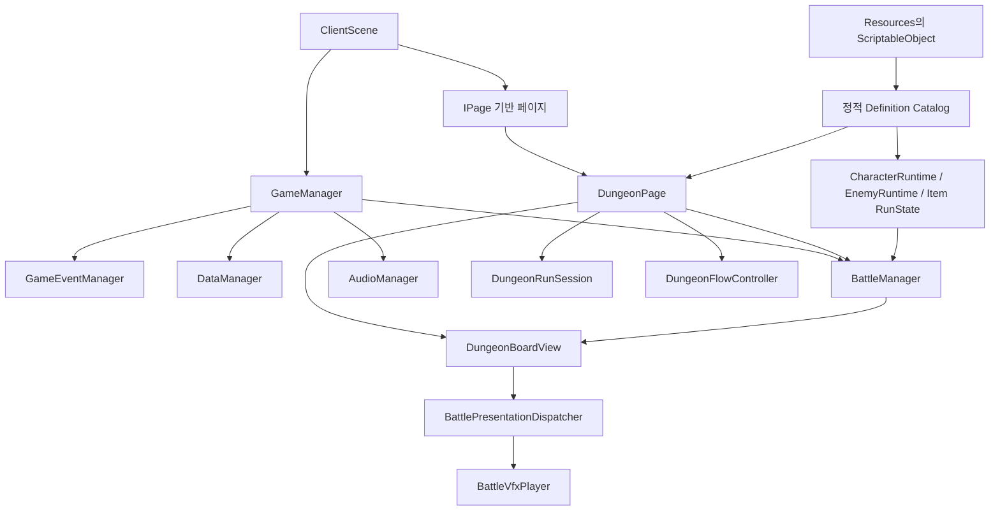
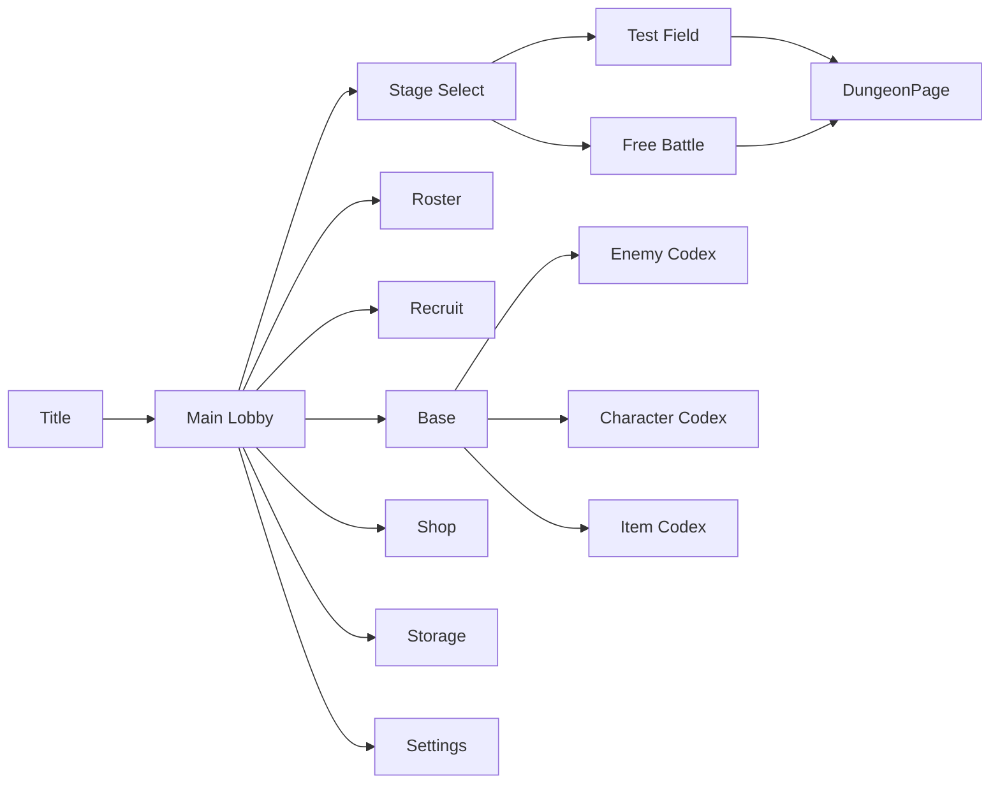
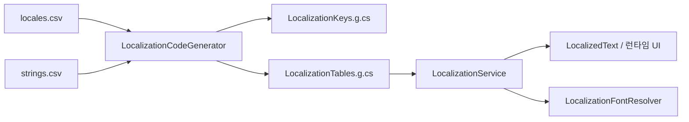

# PS260714 게임 구조 문서

> 기준일: 2026-08-03
>
> 기준 버전: Unity 6000.3.11f1
>
> 분석 범위: `Assets/10_Scripts`, `Assets/07_Runtime/Resources`, `Assets/11_LocalizationSource`, `Assets/05_Scenes/ClientScene.unity`

## 1. 프로젝트 요약

현재 구현은 한 개의 클라이언트 씬에서 메뉴, 캐릭터 관리, 모집, 던전 진행, 자동 전투를 운용하는 ScriptableObject 중심 구조다.

- 정적 콘텐츠는 `CharacterSO`, `EnemySO`, `ItemDefinitionSO`, `StatusEffectSO`, `BattleSO`, `DungeonDefinition` 등의 에셋으로 작성한다.
- 실제 플레이 상태는 `CharacterData`, `CharacterRuntime`, `EnemyRuntime`, `BattleItemRunState`, `DungeonRunSession` 등 별도의 런타임 객체가 가진다.
- `GameManager`가 전역 이벤트, 데이터, 오디오, 전투 관리자를 연결한다.
- 전투는 `BattleManager`가 시간을 진행하고, `DungeonBoardView`가 보드·타겟·상태효과·적 능력·표현 이벤트를 처리한다.
- CSV 로컬리제이션 원본은 에디터에서 C# 테이블로 생성되며 빌드에서는 CSV를 읽지 않는다.
- 영구 데이터는 현재 `PlayerPrefs`에 설정값과 버전이 포함된 JSON을 저장한다.

## 2. 상위 구조

구조는 크게 다음 여섯 층으로 구분할 수 있다.

| 층 | 책임 | 주요 코드 |
|---|---|---|
| 앱 루트 | 싱글턴, 서비스 연결, 전역 이벤트 | `GameManager`, `GameEventManager` |
| 페이지/UI | 화면 전환, 로비, 도감, 모집, 던전 UI | `IPage`, `RuntimeMenuPageBase`, `MainSubPage`, `DungeonPage` |
| 콘텐츠 정의 | 에디터에서 작성하는 정적 게임 규칙 | 각종 `*SO` |
| 런타임 모델 | 체력, 쿨다운, 보유 상태, 진행 상태 | `CharacterRuntime`, `EnemyRuntime`, `DungeonRunSession` |
| 전투 코어 | 전투 시간, 자원, 소환, 효과, 타겟 선정 | `BattleManager`, `IBattleBoard`, `BattleEffectExecutor` |
| 서비스/도구 | 저장, 로컬리제이션, 폰트, 오디오, 에디터 제작 도구 | `DataManager`, `LocalizationService`, `PS260714/* Editor` |

현재 별도 Assembly Definition은 없으며 런타임 코드는 기본 `Assembly-CSharp`, 에디터와 에디터 테스트는 `Assembly-CSharp-Editor` 경계에 있다.

## 3. 시작과 전역 수명 주기

### 3.1 초기화 순서

1. `LocalizationService.Initialize`가 씬 로드 전에 저장된 언어와 폰트를 복구한다.
2. 씬 로드 후 `LocalizationBootstrap`이 폰트 리졸버와 로컬리제이션 구성을 보장한다.
3. `DataManager.Awake`가 캐릭터 컬렉션, 인벤토리, 출석 진행 데이터를 먼저 로드하고 출석 서비스를 구성한다.
4. `GameManager.Awake`가 싱글턴이 되고 `GameEventManager`, `BattleManager`, `AudioManager`를 연결한다.
5. `DataManager.Start`가 디스플레이·오디오 설정을 로드하고 현재 전체 데이터를 저장한 뒤 `DataReady`를 통지한다.
6. 페이지가 활성화되면서 각 UI가 데이터·언어 변경 이벤트를 구독한다.

`GameManager`는 `DontDestroyOnLoad`를 사용하지만 현재 등록된 플레이 씬은 `ClientScene` 하나이므로, 실제 화면 전환은 대부분 씬 이동이 아니라 페이지 GameObject 활성화 전환이다.

### 3.2 전역 이벤트

`GameEventManager`는 요청과 결과 알림을 분리한다.

- 저장/불러오기: `SaveAllRequested`, `LoadAllRequested`, `DataReady`
- 화면 설정: 밝기, FPS, 화면 모드, 해상도
- 오디오 설정: 채널별 볼륨, 백그라운드 음소거
- 언어/폰트: 변경 요청과 변경 완료 알림
- 사운드 재생: BGM, SFX, UI 사운드 요청

UI는 직접 서비스 상태를 변경하기보다 이벤트를 요청하고, `GameManager`·`DataManager`·`AudioManager`가 이를 적용하는 형태다.

## 4. 페이지와 화면 이동

모든 주요 화면은 `IPage`의 `Init`, `Open`, `Close` 규약을 따른다. `PageOpenMode.Fresh`는 새 진입, `Resume`은 기존 상태 복귀에 사용된다.

- `TitlePage`: 시작, 공지 팝업, 설정 진입
- `MainPage`: 대표 캐릭터가 보이는 메인 로비, 공지·출석 팝업과 각 콘텐츠 진입
- `StageSelectPage`: `test_field`, `free_battle` 선택
- `MainSubPage`: Base, Roster, Shop, Recruit, Storage를 타입별로 공유 구현
- `RuntimeMenuPageBase`: 공통 레이아웃, 버튼 생성, 로컬리제이션, 페이지 이동 제공
- `SettingPage`: 호출한 페이지를 기억했다가 닫을 때 복귀
- `EnemyCodexPage`, `CharacterCodexPage`, `BattleCardCodexPage`: Resources의 정의를 조회해 런타임 도감 구성

Base의 기존 Skills 진입은 제거되어 있고 전투 보조 기능은 Item 중심으로 노출된다. Base 시설, Shop, Storage의 일부 화면은 현재 플레이스홀더 단계다.

## 5. 정적 콘텐츠와 런타임 데이터 분리

| 정의 에셋 | 런타임 대응 | 핵심 책임 |
|---|---|---|
| `CharacterSO` | `CharacterData`, `CharacterRuntime` | 프로필, 역할, 공격·패시브·스킬, 영구/던전 강화 |
| `EnemySO` | `EnemyRuntime` | 이름, 등급, 타입, 스탯, 크기, 스택 정책, 능력 |
| `ItemDefinitionSO` | `InventoryData`, `BattleItemRunState` | 아이템 메타데이터, 영구 수량, 런 내 사용 횟수 |
| `StatusEffectSO` | 대상별 `StatusEffectRuntimeState` | 지속시간, 스택, 틱, 능력 제한, 스탯 변화 |
| `BattleSO` | `BattleSetup` | 필드 크기, 적 등급 구성, 소환 간격, 제한시간 |
| `DungeonDefinition` | `DungeonRunSession` | 페이즈, 전투 수, 튜토리얼, 완료 목적지, 수정 모듈 |
| `BattleVfxCueSO` | `BattleVfxRequest` | 시전·투사체·피격·상태효과·등장·사망 연출 |
| `AttendanceRewardScheduleSO` | `AttendanceData` | n일 출석 보상, 반복 여부, 일자 초기화 정책과 수령 진행 |

정적 카탈로그는 `Resources.LoadAll`을 사용한다.

- 캐릭터: `Resources/Characters`
- 적: `Resources/Enemies`
- 아이템: `Resources/ItemCatalog` 우선, 없으면 `Resources/Items`
- 상태효과: `Resources/StatusEffects`
- 던전: `Resources/Dungeons`

ID 중복은 각 카탈로그 또는 검증기에서 오류로 처리한다.

## 6. 던전 진행 구조

### 6.1 런 생성

`DungeonPage.StartNewRun`의 흐름은 다음과 같다.

1. 이전 전투·파티·보드·런 아이템을 정리한다.
2. 실행 시드와 전투 횟수를 결정한다.
3. `DungeonDefinition` 또는 `DungeonFlowPolicy`에서 페이즈 배열을 만든다.
4. `DungeonRunSession.Begin`으로 현재 던전, 시드, 전투 수, 페이즈를 기록한다.
5. 전체 전투의 난이도와 난수 시드를 `DungeonBattlePlan`으로 미리 생성한다.
6. 보유 캐릭터 중 시작 후보 3명을 결정하고 한 명을 선택한다.
7. Battle/Event/Rest/Shop 페이즈를 순차 진행한다.

기본 자유 전투는 5~8회의 전투와 사이 이벤트를 구성한다. 첫 전투 난이도는 0, 마지막은 100이며 중간 전투는 이전 값보다 증가하도록 난수 보정된다.

### 6.2 런 상태

`DungeonRunSession`은 다음 상태를 메모리에 보유한다.

- 던전 정의와 콘텐츠 버전
- 런 시드와 현재/전체 전투 번호
- 현재 활동: 시작 선택, 튜토리얼, 전투, 이벤트, 휴식, 상점, 결과
- 결과: 진행 중, 클리어, 패배
- 튜토리얼 단계와 선호 전투 속도
- 임시 정수·실수·문자열 상태 가방
- 여러 원인을 동시에 표현하는 일시정지 플래그

일시정지 원인은 페이지 숨김, 튜토리얼 안내, 사용자 일시정지, 결과 화면, 비전투 페이즈로 분리되어 한 원인을 해제해도 다른 원인이 남아 있으면 전투가 재개되지 않는다.

현재 던전 런 자체는 저장되지 않으므로 애플리케이션을 종료한 뒤 런을 이어 하는 구조는 아니다.

### 6.3 확장 모듈

`DungeonModifier`는 다음 훅을 제공한다.

- 런 시작
- 페이즈 진입
- 전투 시작
- 전투 종료
- 런 종료

던전별 특수 규칙은 `DungeonPage`를 직접 수정하지 않고 modifier 에셋으로 추가할 수 있다.

## 7. 전투 루프

`BattleManager`의 상태는 `Uninitialized → Idle → Running/Paused/Suspended → Completed`로 이동한다.

Running 상태의 매 프레임 처리 순서는 다음과 같다.

1. 전투 제한시간 감소
2. 공용 액티브 스킬 에너지 충전
3. 보드 상태효과 틱
4. 적 쿨다운 능력 틱
5. 각 `CharacterRuntime`의 상태효과·패시브·기본 공격 틱
6. 적 소환 큐 진행
7. 승리 조건 검사

수동 타겟 선택이 시작되면 전투 시간 배율을 0으로 두고, 선택 완료 또는 취소 후 원래 전투 상태로 돌아간다. 전투 속도는 1×, 2×, 3× 순환을 지원한다.

### 7.1 공용 전투 에너지

- 기본 최대치: 3
- 기본 회복 주기: 5초
- 캐릭터 액티브 스킬과 전투 아이템이 같은 `IActiveSkillResource`를 사용한다.
- 던전 이벤트에서 최대 에너지 또는 회복 속도를 강화할 수 있다.

## 8. 보드, 스택, n×n 적 배치

`DungeonBoardView`는 기본 3×3에서 최대 9×9까지의 정사각형 보드를 지원한다.

### 8.1 일반 적

- 1×1이며 `Stackable`이면 한 타일에 전투 설정의 최대 스택 수까지 겹칠 수 있다.
- 타겟과 피해는 해당 타일의 최상단 적을 기준으로 한다.
- 자동 배치는 현재 가장 낮은 스택 수의 후보 중 하나를 선택한다.

### 8.2 다중 칸 적

- `EnemySO`는 폭·높이를 각각 1~9로 가진다.
- 면적이 2칸 이상이면 스택 정책은 항상 `Exclusive`로 정규화된다.
- 배치 후보를 만들 때 범위를 벗어나거나, 일반 적 스택이 있거나, 다른 전용 점유가 있거나, 같은 그룹에서 예약된 칸이면 실패한다.
- 실제 적 카드는 좌상단 anchor 타일에 하나만 들어가며 나머지 칸은 동일 적의 전용 점유 칸으로 등록된다.
- 범위 판정과 인접 능력은 anchor만이 아니라 점유한 전체 타일 집합을 기준으로 거리를 계산한다.

현재 등록된 적 에셋은 모두 1×1이지만 런타임과 보드 로직은 2×2, 2×3, 3×3 등 직사각형 크기를 이미 처리한다.

### 8.3 소환 실패와 대기

소환 큐 처리 규칙은 다음과 같다.

1. 큐 앞에서부터 배치 가능한 적 또는 소환 그룹을 검사한다.
2. 큰 적이나 그룹을 놓을 수 없으면 그 다음 큐 항목을 검사한다.
3. 배치 가능한 다음 적이 있으면 해당 적부터 소환한다.
4. 어떤 적도 배치할 수 없으면 `IsBoardFull` 상태로 소환 타이머를 0에서 대기시킨다.
5. 적 사망·제거 등으로 `OccupancyChanged`가 발생하면 즉시 재시도를 예약한다.

그룹 소환은 후보 타일을 예약하면서 백트래킹하여 서로 겹치지 않는 전체 배치 조합을 찾은 뒤 한 번에 커밋한다. 중간 커밋이 실패하면 이미 추가한 카드도 되돌린다.

## 9. 캐릭터 구조

### 9.1 데이터 계층

- `CharacterSO`: 변경되지 않는 캐릭터 정의
- `CharacterProgressData`: 보유 여부와 누적 강화 레벨
- `CharacterData`: 정의와 진행 데이터를 합쳐 최종 스탯·능력 값을 계산
- `CharacterRuntime`: 전투 체력, 보호막, 쿨다운, 상태효과, 타겟, 연출과 입력 처리

역할과 아키타입은 별도 `CharacterRoleSO`, `CharacterArchetypeSO`로 분리되어 있고 유효한 조합만 적용된다. 등급 색상·아이콘은 `CharacterGradePaletteSO`, 역할 표시 정보는 `CharacterRoleCatalogSO`가 담당한다.

### 9.2 행동 정의

캐릭터는 목록 기반으로 여러 정의를 조합할 수 있다.

- 공격: 대상, 조건, 연계, 피해 방식, 효과, 범위, 타겟 유지
- 패시브: 공격 선택·명중·실패·처치·상태 변화·쿨다운 등의 트리거
- 액티브 스킬: 비용, 대상, 효과, 실행 정책
- 누적 강화: 영구 진행 데이터에 저장되는 강화
- 던전 강화: 현재 런의 `CharacterData`에만 적용되는 강화

효과는 물리/마법/고정 피해, 상태 부여·제거, 회복, 보호막, 자원 획득·소모, 체력 소모 등을 지원한다. `EffectContext`와 scaling 값으로 공격력, 자원, 현재/최대 체력, 상태 스택 등을 계산식에 포함할 수 있다.

### 9.3 타겟 선정과 연계

지원하는 기본 대상 방식은 무작위, 전체, 최저/최고 값, 자신, 자신 제외, 수동 선택이다. 대상 조건은 체력, 체력 비율, 보호막, 스택, 상태효과 등의 수치 조건으로 필터링한다.

- `LockUntilInvalid` 공격은 대상이 유효한 동안 유지하고 사라지면 새 대상을 찾는다.
- 연계 행동은 이전 공격의 시도/성공/실패 조건을 검사한다.
- 이전 행동의 대상을 재사용하는 연계는 먼저 살아 있는 유효 대상만 필터링한다.
- 상속 대상이 비었으면 연결 가능한 기본 공격 정의의 규칙으로 새 타겟을 찾는다.
- 효과별 `FreshSelection`은 행동 대상과 별개로 새 대상을 선택한다.
- 수동 대상은 보드의 후보 하이라이트와 전투 일시정지를 사용한다.

이 구조로 공격 전에 연계 스킬을 사용하거나 마지막 공격 대상이 사라진 경우에도 유효하지 않은 참조를 그대로 공격하지 않고 새 타겟을 탐색한다.

## 10. 적 구조

`EnemySO`는 다음 정보를 정의한다.

- ID, 이름/설명 로컬리제이션 키, 카드 코드
- 등급과 적 타입
- 아이콘, 보드 스프라이트, 정렬 순서
- 기본 체력, 체력 배율, 방어도, 보호막
- 소환 간격 배율, 위협 비용, 해금 난이도
- 보드 폭·높이와 스택 정책
- 등장·사망 VFX
- 조건, 대상, 트리거, 연산으로 구성된 능력 목록

`EnemyRuntime`은 체력, 보호막, 방어도, 상태효과, 능력 쿨다운·충전 횟수를 개체별로 독립 보유한다.

현재 적 정의는 다음과 같다.

| 적 | 현재 핵심 동작 |
|---|---|
| Basic | 별도 능력 없음 |
| Assault | 별도 능력 없음 |
| Heavy | 제한 횟수의 물리/마법 피격 피해를 1로 감소 |
| Medic | 주기적으로 인접 아군 회복 |
| Mechanic | 누적 피해가 가장 높은 플레이어 캐릭터 기절 |
| Pointman | 소환 큐의 추가 적을 그룹으로 확장 소환 |
| Shield Bearer | 등장 시 방어도 획득, 인접 아군 피해 대신 받기 |
| Infiltrator | 다른 적이 있으면 일반 타겟 우선순위에서 제외 |

적 능력은 등장, 쿨다운, 피격 전, 아군 피격 전, 사망, 소환 큐 평가, 타겟 우선순위 평가 등의 트리거를 지원한다.

## 11. 상태효과 구조

`StatusEffectSO`는 아군/적 공통 정의다.

- 정렬: 버프, 디버프, 중립
- 지속: 시간제 또는 영구
- 스택: 추가 후 갱신, 추가 후 기존 시간 유지, 독립 시간, 교체
- 제거 순서: 오래된 순, 최신 순, 무작위
- 연산: 주기/즉시 피해, 공격력·공격속도 변화, 행동 차단
- 지속 스탯: 공격력, 공격속도, 받는 피해, 타겟 우선순위
- 제어: 전체 행동, 기본 공격, 액티브 스킬, 패시브 쿨다운 차단, 강제 타겟
- 수명 주기: 적용, 재적용, 틱, 스택 변경, 만료, 제거

연쇄 상태 이벤트는 큐로 디스패치하며 무한 연쇄를 막기 위한 처리 상한을 둔다. 상태효과 정의는 현재 15개가 등록되어 있다.

## 12. 아이템과 인벤토리

### 12.1 공통 아이템

`ItemDefinitionSO`의 공통 필드는 다음과 같다.

- 안정적인 `itemId`
- 카테고리와 희귀도
- 이름/설명 로컬리제이션 키와 기존 텍스트 폴백
- 아이콘과 정렬 순서
- 최대 스택과 초기 지급량
- 창고 숨김 여부

하위 타입은 일반 아이템, 재화, 모집권, 강화 재료, 전투 아이템이다.

`InventoryData.TryApply`는 여러 증감 내역을 먼저 합산·검증한 뒤 한 번에 적용하므로 모집 비용 차감과 아이템 보상 지급을 하나의 인벤토리 트랜잭션으로 처리할 수 있다.

### 12.2 전투 아이템

전투 아이템은 영구 인벤토리 수량과 별도로 던전 런 안에서 `BattleItemRunState`를 가진다.

| 사용 정책 | 런타임 의미 |
|---|---|
| `SingleUse` | 획득당 1회 추가 |
| `LimitedUse` | 획득당 설정한 n회 추가 |
| `UnlimitedUse` | 획득 후 횟수 차감 없이 사용 |

추가 규칙은 다음과 같다.

- `MaximumRunUses`가 0이면 런 내 누적 상한이 없다.
- 성공한 사용만 횟수를 차감하고 쿨다운을 시작한다.
- 효과 적용이 실패하면 먼저 소비한 에너지를 반환한다.
- 새 전투 시작 시 아이템 쿨다운은 초기화되지만 보유 횟수는 런 동안 유지된다.
- 시작 아이템 후보 중 하나를 무작위 지급할 수 있다.
- 이벤트 보상으로 동일 아이템을 다시 획득하면 사용 횟수가 누적된다.

현재 등록된 전투 아이템은 모두 `SingleUse`이며 다음 효과를 가진다.

| 아이템 | 대상 | 비용 | 효과 |
|---|---:|---:|---|
| Focus | 적 | 1 | 5초 동안 최우선 공격 대상으로 지정 |
| Molotov | 적 | 3 | 3초 동안 1초 간격 화염 피해 |
| Precision Shot | 적 | 2 | 고정 피해 5 |
| Over Supply | 캐릭터 | 3 | 5초 동안 공격속도 2배 |
| Overheat | 캐릭터 | 3 | 3초 동안 공격력 2배 |

효과 종류와 대상 호환성은 `BattleItemSO.IsEffectCompatible`에서 검증한다.

## 13. 모집 구조

모집 정의는 현재 `MainSubPage`의 `RecruitBannerPageDefinition` 배열에 직렬화된다.

- 1회/10회 모집
- 가중치 또는 퍼센트 입력
- 등급 확률과 등급 내부 보상 확률의 2단계 추첨
- 캐릭터, 아이템, 더미 보상
- 여러 결제 경로와 우선순위
- 보유량을 고려한 결제 경로 자동 선택
- 캐릭터 최초 획득 판정과 아이템 보상 지급
- 결과 공개 오버레이

모집 실행 시 확률표와 결제 경로를 먼저 검증하고, 인벤토리 비용·아이템 보상을 함께 적용한 뒤 캐릭터 보유 상태를 갱신한다. 중복 캐릭터에 대한 별도 교환 보상은 현재 없다.

`totalRecruitCount`, `currentStack`, `maximumStack` 표시 필드는 존재하지만 현재 코드에서는 누적 횟수만 런타임 메모리에서 증가하며 별도 영구 저장 경로와 실제 스택 증가/보정 규칙은 연결되어 있지 않다.

## 14. 저장과 손상 복구

### 14.1 저장 대상

| 데이터 | 저장 위치 |
|---|---|
| 화면·오디오 설정 | 개별 `PlayerPrefs` 키 |
| 언어·폰트 | `Localization.Locale`, `Localization.FontId` |
| 대표 캐릭터 | `Lobby.RepresentativeCharacterId` |
| 캐릭터 보유·누적 강화 | `Characters.Collection.v1` JSON |
| 아이템 수량 | `Inventory.Collection.v1` JSON |
| 출석 진행 | `Attendance.Progress.v1` JSON |
| 던전 런 상태 | 현재 저장하지 않음 |

### 14.2 손상 대응

캐릭터, 인벤토리, 출석 저장은 공통적으로 다음 방어 절차를 가진다. 인벤토리와 출석 데이터가 사용하는 JSON 필드 검사는 `LocalSaveInfrastructure`에 모여 있다.

1. JSON에 필수 최상위 필드가 있는지 확인한다.
2. `JsonUtility` 역직렬화와 스키마 버전을 검사한다.
3. 정상 저장을 덮기 전 기존 정상 값을 `.backup` 키로 보존한다.
4. 주 저장이 손상되면 정상 백업을 복구한다.
5. 거부한 원본은 `.corrupt` 키에 보존한다.
6. 백업도 사용할 수 없으면 안전한 초기 메모리 상태를 만들되 자동 저장을 차단한다.

저장 차단은 손상된 원본을 새 기본값으로 조용히 덮어써 복구 가능성을 없애는 일을 방지한다. `LocalDataLoadStatus`로 성공, 신규 초기화, 마이그레이션, 백업 복구, 손상, 미지원 버전을 구분한다.

캐릭터 컬렉션은 버전 필드가 없는 구형 JSON을 v1로 마이그레이션할 수 있다. 인벤토리와 출석 진행은 현재 명시적인 v1 스키마만 허용한다.

`LocalDataResetService`는 로컬 플레이어 데이터만 삭제하며 SO 에셋에는 관여하지 않는다. 옵션이 켜진 플레이어 빌드는 새 build GUID에서 한 번 자동 초기화할 수 있다.

### 14.3 출석 체크

메인 로비의 공지 옆 `ATTENDANCE` 버튼은 `AttendancePopupView`를 열며, 당일 보상은 사용자가 명시적으로 수령한다.

- 기본 서비스 일자는 UTC+9 자정을 기준으로 계산하고 `IAttendanceClock`으로 시간 공급원을 분리했다.
- 보상을 놓친 날은 건너뛰지 않고 다음 접속일에 다음 순번 보상을 받는다.
- 일정은 n일 길이와 반복 여부를 지원한다. `scheduleId` 또는 콘텐츠 버전이 바뀌면 진행 순번을 초기화하되 마지막 관측일과 당일 수령일은 보존한다.
- 시스템 일자가 마지막 관측일보다 뒤로 이동하면 수령을 차단한다.
- 보상은 여러 `ItemDefinitionSO`와 수량으로 구성된다. 인벤토리 스택 한도와 `long` 오버플로를 미리 검사하며 일부 지급은 허용하지 않는다.
- 인벤토리 반영과 출석 커밋은 메모리 스냅샷을 가진 하나의 지급 흐름으로 처리하고 두 저장을 기록한 뒤 `PlayerPrefs.Save`를 한 번 호출한다.
- `Resources/Attendance/DefaultAttendanceSchedule` 에셋이 있으면 사용하고, 없으면 개발용 7일 기본 일정이 동작한다.
- 현재 로컬 시계 기반이므로 시간을 앞으로 조작하는 행위까지 신뢰성 있게 막으려면 추후 서버 시간과 계정 권위 저장이 필요하다.

## 15. 로컬리제이션과 폰트

현재 지원 언어는 `ko-KR`, `en-US`이며 문자열 원본은 약 340개 행이다.

- 빌드는 생성된 C# 사전만 사용한다.
- 언어별 폴백 체인을 지원하고 최종적으로 기본 언어 `ko-KR`을 사용한다.
- `{duration:0.#}` 같은 이름 기반 포맷 인자를 지원한다.
- `[style=id]`, `[icon=id]`, `[br]` 마크업을 안전한 TMP 태그로 변환한다.
- 외부 인자는 이스케이프하여 TMP 태그 주입을 막는다.
- `body`, `title`, `tooltip` 등 font role과 언어별·사용자 선택 폰트 오버라이드를 지원한다.
- `LocalizedText`는 언어·폰트 변경 이벤트에 반응해 즉시 갱신한다.
- 캐릭터, 적, 상태효과, 아이템은 로컬리제이션 키와 기존 문자열 폴백을 함께 가진다.

에디터의 Localization Pipeline Guard는 CSV 검증 실패나 생성 코드가 오래된 상태에서 플레이 모드 진입·빌드를 막는다.

## 16. 전투 표현과 VFX

전투 판정과 표현은 이벤트로 분리되어 있다.

1. 보드/효과 실행기가 효과 해결, 상태 수명 주기, 유닛 등장·사망 이벤트를 발행한다.
2. `BattlePresentationDispatcher`가 정의에 연결된 cast/projectile/impact/status/spawn/death cue를 선택한다.
3. 보드의 `IBattleVfxTargetResolver`가 적·캐릭터의 화면/월드 anchor를 해석한다.
4. `BattleVfxPlayer`가 요청 큐, 지연 실행, persistent loop, 동시 실행 한도, 중요도, 품질 예산을 적용한다.

VFX cue는 단일 연출뿐 아니라 여러 clip을 가진 composite 연출, 타겟 추적, 직선·포물선 이동, 자연 재생·시간 맞춤·반복, 타일 상대 크기 등을 지원한다.

## 17. 현재 등록 콘텐츠

| 종류 | 수량 | 비고 |
|---|---:|---|
| 씬 | 1 | `ClientScene` |
| 캐릭터 | 9 | 모두 Resources 정의 |
| 적 | 8 | 현재 에셋은 모두 1×1 |
| 아이템 | 10 | 재화 3, 모집권 1, 강화재료 1, 전투 아이템 5 |
| 상태효과 | 15 | 공통 상태효과 카탈로그 |
| 던전 정의 | 2 | Free Battle, Test Field |
| 튜토리얼 정의 | 1 | Test Field Tutorial |
| 전투 VFX cue | 5 | Fire, SingleHeal, SinglePick, SingleShot, SingleSlash |
| 출석 일정 | 1 | 개발용 7일 기본 일정, Resources SO로 교체 가능 |
| 지원 언어 | 2 | 한국어, 영어 |

## 18. 제작용 에디터 도구

`PS260714` 메뉴 아래에 다음 제작 도구가 있다.

- Character Editor
- Enemy Editor
- Item Editor
- Status Effect Editor
- Recruit Editor
- Battle VFX Editor와 VFX 검증
- Localization Editor, CSV 검증, C# 생성
- Common Settings
- 메인 로비/페이지 designer UI 검증 및 마이그레이션 도구

Character, Enemy, Item, Status Effect 에디터는 공통적으로 검색, 새 에셋, 저장, 복제, 이름 변경, 삭제, Ping, 새로고침 흐름을 제공한다. 각 정의 검증기는 ID 중복, 잘못된 대상 조합, 누락된 능력/효과, 범위를 벗어난 수치 등을 진단한다.

## 19. 테스트 구조

현재 코드 기준 테스트 표식은 에디터 테스트 388개, PlayMode 테스트 1개다.

- 캐릭터 정의·등급·전투 회귀
- 적 정의·능력·n×n 배치·소환 큐 회귀
- 아이템·인벤토리·저장 손상·전투 아이템
- 출석 일자 경계·순차/반복 수령·중복 방지·시간 역행·스택 한도·백업 복구
- 상태효과 편집과 실행 규칙
- 모집 확률·결제·보상·공개 UI
- 로컬리제이션 CSV·생성 코드
- 전투 VFX 마이그레이션·타임라인·품질 단계

세부 규칙의 EditMode 회귀 범위는 넓지만 실제 씬 수명 주기, 프레임 진행, UI 입력을 함께 검증하는 PlayMode 통합 테스트 비중은 낮다.

## 20. 현재 확장 포인트와 주의점

### 구현되어 있어 콘텐츠 추가로 확장 가능한 부분

- 2×2, 2×3, 3×3 등 다중 칸 적
- 적 능력 트리거·조건·대상·연산 조합
- 전투 아이템의 일회용, n회용, 무제한 사용 정책
- 던전별 고정 전투, 적 풀 오버라이드, flow policy, modifier
- 캐릭터의 다중 공격·패시브·스킬과 조건·연계·범위 효과
- 언어, 역할별 폰트, 사용자 선택 폰트, 마크업 스타일 추가

### 아직 제품 규칙 또는 인프라가 필요한 부분

- Shop, Storage, Base 시설의 실제 경제·보상 규칙
- 던전 진행 중 종료 후 재개 저장
- 모집 스택/천장 증가·보정·영구 저장과 중복 캐릭터 보상
- 현재 1×1뿐인 실제 다중 칸 적 콘텐츠와 전용 아트/UX
- PlayMode·빌드 환경의 통합 테스트 확대
- 온라인 계정, 클라우드 저장, 서버 권위 경제가 필요한 경우 PlayerPrefs 저장 교체
- 출석의 앞으로 이동한 로컬 시계 조작 방지와 계정 간 동기화를 위한 서버 시간·서버 수령 원장

### 구조적 기술 부채

- `CharacterRuntime`, `CharacterSO`, `DungeonPage`, `DungeonBoardView`에 많은 책임이 집중되어 있다.
- Assembly Definition이 없어 작은 변경도 넓은 범위의 재컴파일과 결합 영향을 만들 수 있다.
- 정적 카탈로그가 `Resources.LoadAll` 기반이므로 콘텐츠 규모가 크게 늘면 Addressables 또는 명시적 카탈로그 로딩 정책 검토가 필요하다.
- 페이지 참조가 씬 GameObject와 이름에 의존하는 곳이 있어 UI 계층 이름 변경 시 검증 도구를 반드시 함께 실행해야 한다.
- 전투 효과의 공통 계약은 존재하지만 캐릭터·적·상태효과별 정의가 큰 파일에 분산되어 있어 신규 효과 추가 시 여러 validator와 executor를 함께 갱신해야 한다.

## 21. 콘텐츠 추가 작업 순서

### 캐릭터

1. Character Editor에서 `CharacterSO` 생성
2. 역할·아키타입·등급·스프라이트 설정
3. 공격·패시브·스킬·강화 정의 작성
4. 로컬리제이션 키 추가 및 C# 재생성
5. Character validator와 관련 회귀 테스트 실행

### 적

1. Enemy Editor에서 `EnemySO` 생성
2. ID, 등급, 타입, 스탯, 폭·높이 설정
3. 능력 트리거·대상·조건·연산 구성
4. 이름·설명·능력 로컬리제이션 연결
5. Enemy validator와 배치/능력 회귀 테스트 실행
6. BattleSO 또는 DungeonDefinition의 적 풀에 연결

### 아이템

1. Item Editor에서 하위 타입 선택 후 생성
2. ID, 카테고리, 스택, 이름/설명 키 설정
3. 전투 아이템이면 대상, 사용 정책, 횟수, 비용, 쿨다운, 효과 설정
4. `ItemCatalog.asset` 연결 상태 확인
5. 아이템·인벤토리 테스트 실행

### 던전/전투

1. `BattleSO`에 필드, 적 수, 등급별 풀, 제한시간 설정
2. `DungeonDefinition`에 전투 수·고정 전투·flow policy·튜토리얼·modifier 연결
3. `TryValidate`와 실제 Test Runner 검증
4. Test Field에서 시작 선택, 소환, 보상, 결과 이동까지 통합 확인

## 22. 주요 코드 위치

- 앱 루트: `Assets/10_Scripts/GameManager.cs`
- 데이터 루트: `Assets/10_Scripts/Infrastructure/Data/DataManager.cs`
- 저장: `Assets/10_Scripts/Characters/CharacterData.cs`, `Assets/10_Scripts/Items/InventoryData.cs`, `Assets/10_Scripts/Attendance/AttendanceData.cs`
- 출석: `Assets/10_Scripts/Attendance`, `Assets/10_Scripts/UI/MainPage.cs`
- 전투 관리자: `Assets/10_Scripts/Battle/BattleManager.cs`
- 전투 계약/효과: `Assets/10_Scripts/Battle/BattleContracts.cs`, `Assets/10_Scripts/Core/Effects`
- 던전 오케스트레이션: `Assets/10_Scripts/Run/DungeonPage.cs`
- 보드: `Assets/10_Scripts/Run/DungeonBoardView.cs`
- 캐릭터: `Assets/10_Scripts/Characters/CharacterSO.cs`, `CharacterRuntime.cs`
- 적: `Assets/10_Scripts/Enemies/EnemySO.cs`, `EnemyRuntime.cs`, `EnemyAbilityDefinition.cs`
- 아이템: `Assets/10_Scripts/Items`
- 상태효과: `Assets/10_Scripts/StatusEffects/StatusEffectSO.cs`
- 모집: `Assets/10_Scripts/UI/RecruitBannerView.cs`, `MainSubPage.cs`
- 로컬리제이션: `Assets/10_Scripts/Localization`, `Assets/11_LocalizationSource`
- 제작 도구: `Assets/10_Scripts/Editor`
- 테스트: `Assets/10_Scripts/Tests/Editor`, `Assets/10_Scripts/Tests`
